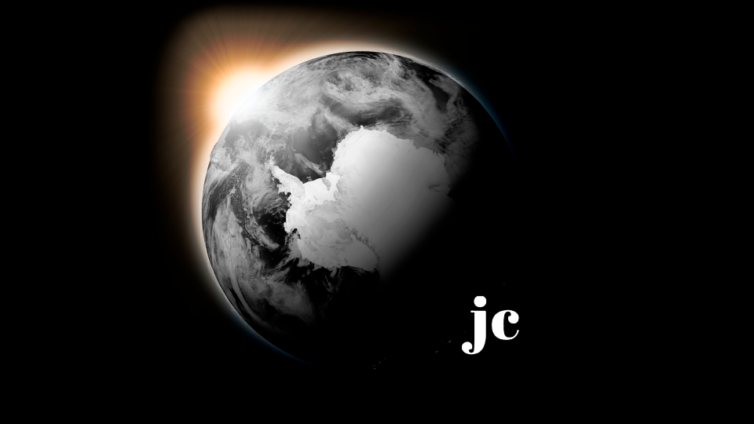
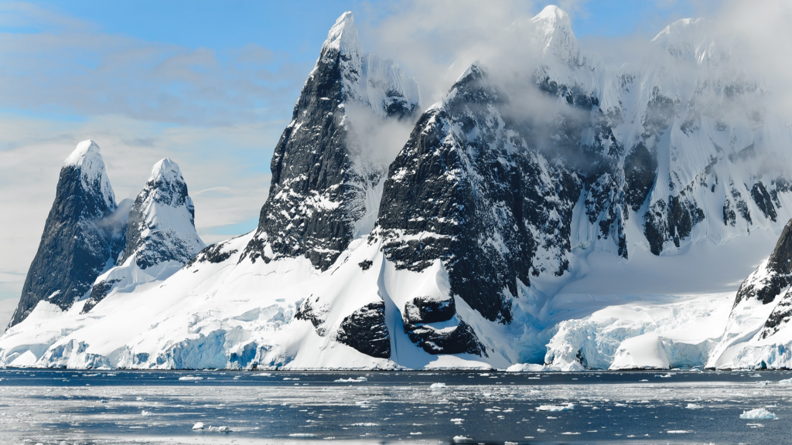
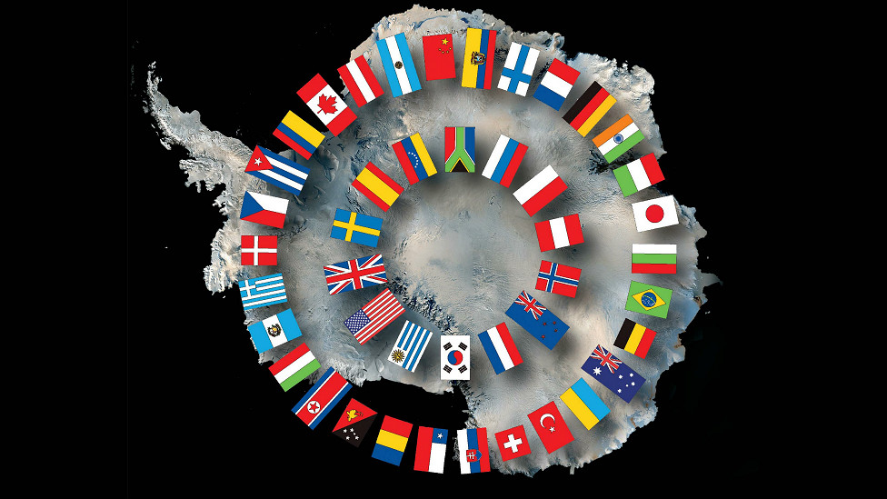
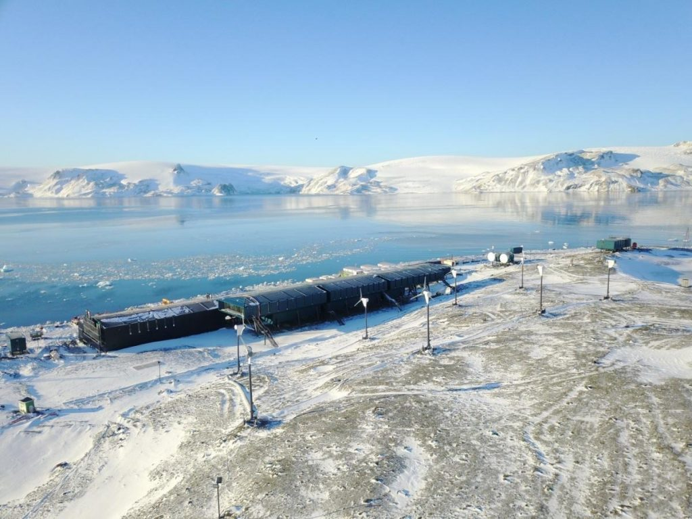

:::: {.texto-justificado}

 

  
  

    Fonte: do autor
  

 

Situada no Polo Sul, a Antártida (ou Antártica como é usualmente empregada na Língua Portuguesa), pode ser descrita como o continente que não tem governo, não pertence a nenhum país e não tem população nativa.  Sua população é flutuante e composta principalmente por equipes de pesquisadores de várias nações que permanecem por períodos determinados, normalmente nos meses no qual o clima é tolerável.

O continente antártico é formado por um imenso planalto de gelo. Possui 98% de sua área coberta por uma camada de gelo com espessura de 2 km. Para dar ideia, sua dimensão territorial equivale a de um Brasil e meio, com cerca de 10% de terras imersas.

A Antártica tem 14 milhões de Km2, mas no inverno esse número aumenta, quase duplica, devido ao congelamento das águas. A maior parte da água doce do mundo (~70% de toda a água doce do planeta) está na Antártida, em forma de gelo. Essa quantidade de água seria capaz de abastecer todos os rios da Terra. 

Clima e temperatura são bastante diferentes considerando a abrangência de sua área (região costeira e seu interior). No inverno a escuridão tem duração de 4 a 6 meses (abril – setembro) com temperaturas que atingem até 50ºC abaixo de zero, mas com tempo bom é possível ter a luz da lua e ver estrelas. Neste período também não há disponibilidade de voos, pois devido às temperaturas extremamente baixas o combustível das aeronaves pode gelificar, além disso, os aviões e tudo que carregam ficam extremamente rígidos e frágeis. Portanto, neste período, não existe ajuda externa caso algo aconteça. No verão, a média na costa é de 10 °C negativos, mas no interior do continente atinge temperaturas de até 40 °C negativos.

Em 1893 foi feito o registro de menor temperatura do planeta, cerca de 89ºC negativos em Vostok, em uma base russa a uma altitude de 3.400 metros localizada no interior da Antártica e, recentemente, em fevereiro de 2020, foi feito o registro da maior temperatura, 18,3ºC na Base de Esperanza, estação de pesquisa da Argentina no Hemisfério Ocidental, perto da América do Sul e, por isso, com  clima mais ameno (onde a temperatura média no inverno é de 10°C negativos e próximos a 0°C no verão) sendo a área onde se encontra o maior número de estações de pesquisa. O registro anterior de 17,5 °C ocorreu em março de 2015 nesta mesma área. Essas alterações climáticas (aquecimento) estão causando a redução da camada protetora de ozônio da atmosfera, poluição atmosférica bem como o derretimento parcial do gelo evidenciando mudanças climáticas em termos globais.

### DESCOBERTA DA ANTÁRTIDA

 

  
  

    Fonte: Volodymyr Goinyk – Disponível no banco de imagens do Canva Pro
  

 

A Antártica foi o último continente a ser descoberto. No fim do século XVIII e início do XIX a exploração da Antártica e de seus arredores era orientada por interesses comerciais, dos quais o principal era a caça de mamíferos marinhos.  Não há clareza de fatos, pela falta de registros, sobre a descoberta da Antártida. O inglês James Cook, entre os anos de 1768 e 1771, navegou por diversas vezes ao redor desse continente gelado. Entretanto, o norte-americano Nathaniel Palmer pode ter sido o primeiro a pisar neste continente. Além disso, é provável que um maior número de explorações tenha ocorrido devido ao interesse na caça de focas e de baleias, mas, como os pontos de caça eram mantidos em sigilo para não atrair concorrentes, não há registros confiáveis. Há registros que o norueguês Roald Amundsen e o britânico Robert Scott foram os primeiros a documentar chegada ao Polo Sul. Amundsen chegou ao Polo Sul em dezembro de 1911 concluindo com sucesso uma viagem muito bem planejada. Scott, por sua vez, chegou ao Polo Sul poucas semanas depois, mas morreu na viagem de volta após uma série de infortúnios. Na câmera fotográfica encontrada com os espólios de sua expedição há o registro da bandeira norueguesa fincada sobre o Polo Sul.

Posteriormente, com a descoberta de jazidas minerais bem como de gás natural, por expedições realizadas principalmente por russos, britânicos e norte-americanos, a Antártica passou por uma série de disputas pela posse de seu território e de suas riquezas naturais, que durou por todo século XIX.

### A QUEM PERTENCE À ANTÁRTIDA?

 

  
  

    Tratado da Antártida. Fonte: Conhecimento Científico – R7.
  

 

Para responder esta questão é preciso conhecer o Tratado da Antártida. Este Tratado estabelece a Antártida como um território neutro voltado somente à pesquisa científica. Foi firmado em 1 de dezembro de 1959, em Washington, por nações que reivindicavam a posse de pedaços desse continente. Nesse tratado “países que mantêm reivindicação territorial se comprometem em manter a liberdade de pesquisas científicas, em regime de cooperação internacional”.  Até 2040, ano em que o tratado deve ser revisado, qualquer exploração voltada à obtenção de recursos naturais está proibida.

Os países signatários do Tratado da Antártida se dividem em três grupos. O primeiro é composto pelos sete países que mantêm reivindicação territorial: Reino Unido, Argentina, França, Chile, Noruega, Austrália e Nova Zelândia.  O segundo, composto pela Rússia e Estados Unidos, compõe o grupo com “reserva de direito de reivindicação territorial”, isto é, embora não tenham declarado formalmente o interesse em um território, podem fazê-lo. Além disso, os Estados Unidos têm interesse de ter como parte integrante de seu território, parte da Terra de Mary Byrd (a região mais isolada do continente) ainda não reivindicada por nenhum país. Um terceiro grupo é composto pelos países que são apenas signatários: África do Sul, Alemanha, Bélgica, Bulgária, China, Coreia do Norte, Coreia do Sul, Equador, Espanha, Finlândia, Índia, Itália, Japão, Holanda, Polônia, Portugal, Suécia, Turquia, Ucrânia e Uruguai. O Brasil tem interesse em reivindicar partes do continente dentro da porção ocidental.

A entrada do Brasil no chamado Sistema do Tratado da Antártida em 1975 abriu à comunidade científica nacional a oportunidade de participar de atividades científicas e possibilitou o início ao Programa Antártico Brasileiro (PROANTAR), em 1982. Atualmente, dezenas de bases científicas estudam o continente sendo a Estação Antártica Comandante Ferraz é a base pertencente ao Brasil localizada na ilha do Rei George. Para fazer investigações na Antártica é necessário respeitar o Tratado da Antártida bem como o Protocolo de Madri sobre Proteção Ambiental que entrou em vigor na década de 90 banindo atividades voltadas a exploração de recursos naturais.

 

  
  

    Estação Antártica Comandante Ferraz (EACF) Nova, inaugurada em 2020. Fonte: Marinha do Brasil.
  

 

A Estação Antártica Comandante Ferraz (EACF) começou a operar em fevereiro de 1984, mas foi parcialmente destruída por um incêndio em 2012. Em 15 de janeiro de 2020 as novas edificações da foram inauguradas. Com área construída de cerca de 4.500 m2, a atual base possui vários laboratórios e capacidade de abrigar 64 pessoas. O fornecimento de energia a diesel é complementado por energia solar com 30 módulos fotovoltaicos, e por uma mini usina eólica com 8 aerogeradores, compondo um sistema com 30 % de energia de fontes renováveis. Além disso, todo o lixo produzido é enviado ao Brasil para ser reciclado.

O nosso planeta denomine-se Terra, mas ele é basicamente composto por água.  Portanto, conhecer e cuidar do continente gelado ajuda a preservar esse nosso Lar.

---



---

### FONTES

<a href="http://cienciaantartica.mcti.gov.br/"> Programa Ciência Antática MCTI </a>  
<a href="https://monografias.brasilescola.uol.com.br/imprimir/14213"> O Brasil na Antártica Direitos e Deveres </a>  
<a href="https://mundoeducacao.uol.com.br/geografia/antartida.htm"> Antártida – Mundo Educação -UOL </a>  
<a href="https://super.abril.com.br/mundo-estranho/algum-pais-e-dono-da-antartida/"> Algum país é dono da Antártida? </a>  
<a href="https://www.educamaisbrasil.com.br/enem/geografia/antartida"> Antártida – Educa + Brasil </a>  
<a href="https://www.marinha.mil.br/dhn/?q=pt-br"> Marinha do Brasil – DHN </a>  
<a href="https://www.marinha.mil.br/secirm/"> Marinha do Brasil – CIRM </a>  
<a href="https://www.sinageo.org.br/2018/trabalhos/9/9-168-959.html"> ROQUE, Mariane Paulina Batalha et al. Mapeamento geomorfológico preliminar da Ilha Seymour, Antártica. Os Desafios da Geografia Física na Fronteira do Conhecimento, v. 1, p. 6311-6322, 2017. </a>  
<a href="https://www.terrabrasilis.org.br/ecotecadigital/images/abook/pdf/Set.14.45.pdf"> Antártica : ensino fundamental e ensino médio / coordenação Maria Cordélia S. Machado, Tânia Brito. – Brasília : Ministério da Educação, Secretaria de Educação Básica, 2006. </a>  
<a href="https://www.youtube.com/watch?v=jeEPm4lJhfQ"> Canal do Youtube TVBrasil: Serie Brasil na Antártica: Estação Comandante Ferraz </a>  
<a href="https://www.youtube.com/watch?v=xMnn_KX1Lo8"> Canal do Youtube TV BrasilGov: Conheça a Estação Comandante Ferraz, nova casa do Brasil na Antártica </a> 

::::
