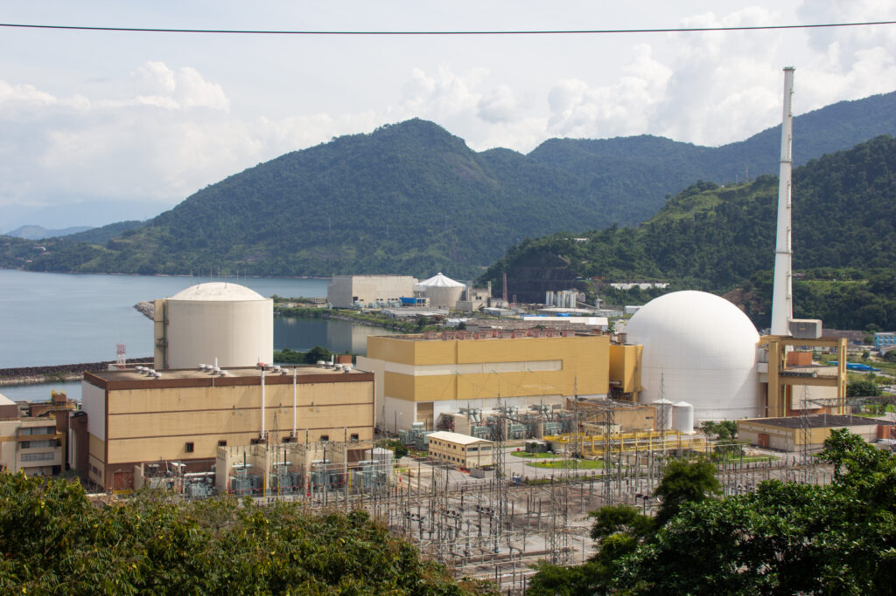

:::: {.texto-justificado}

 

  
  

    Fonte: do autor
  

 

O interesse pelo uso de tecnologia nuclear no Brasil e na Argentina surgiu na década de 1950. Na Argentina o desenvolvimento se deu por meio do Plano Nuclear Argentino (PLAN) que tinha por objetivo fabricar seus próprios equipamentos e reatores.  Assim, em 1968 começou a construir sua primeira central nuclear (Atucha-1), sendo também a primeira da América Latina, que entrou em operação comercial em 1974. No Brasil o programa nuclear teve início em 1951 com a criação Conselho Nacional de Pesquisa (atual CNPq) com o objetivo de projetar um reator de pesquisa e produzir seu combustível. Mas, somente nos anos 1970 teve inicio a  construção da Usina Nuclear de Angra 1, em parceria com os EUA, sendo a segunda usina nuclear da América Latina. Angra 1 começou a ser construída em 1972, mas passou a funcionar comercialmente  somente em 1985.

Nos anos seguintes, o avanço do uso de tecnologia nuclear pela Argentina fez com que o Brasil buscasse progresso, o que foi obtido com o Programa Nuclear Militar (conhecido como programa “Paralelo”) levando ao domínio da tecnologia de enriquecimento de urânio, possibilitando tanto o seu uso civil, como combustível das usinas para geração de energia nuclear, como militar na propulsão naval e possivel produção de armas nucleares.

Desde o início do programa nuclear, tanto no Brasil como na Argentina, existia um temor de uso indevido considerando o poder bélico que pode ser gerado pela energia nuclear (criação de bomba atômica), além de despertar o perigo de uma corrida armamentista, o que chamou a atenção da comunidade internacional. Após um longo período de desconfianças e rivalidades entre os dois países, na década de 1980 a tecnologia do ciclo nuclear foi por adquirida por ambos, o que contribuiu para o processo de geração de confiança e disposição de colaboração.

O ano de 1991 foi fundamental para Brasil e Argentina para assegurar o uso pacífico de tecnologia nuclear. Desde de 18 de junho de 1991 existe um acordo entre os dois países (conhecido como acordo Bilateral) direcionado a compartilhar informações do uso de materiais nucleares para fins pacífico, de forma a assegurar que materiais nucleares não sejam usados para produzir armas nucleares. Essa parceria resultou na criação da Agência Brasileiro-Argentina de Contabilidade e Controle de Materiais Nucleares (ABACC), que tem por objetivo monitorar o uso de materiais nucleares nos dois países assegurando seu uso pacífico.  Para aprimorar esta parceria nuclear, em dezembro de 1991 foi estabelecido o Acordo Quadripartite entre a Argentina, Brasil e ABACC no qual a Agência Internacional de Energia Atômica (AIEA) foi inserida, complementando o sistema de aplicação de salvaguardas nos dois países. Este arranjo baseia-se na construção de confiança entre os dois países vizinhos por meio da inspeção mútua e da presença da AIEA. Para administrar essa tarefa foi criado o Sistema Comum de Contabilidade e Controle de Materiais Nucleares (SCCC).

### Centrais Nucleares

A Argentina possui 3 usinas em operação (Atucha-1, Atucha-2 e Embalse) com a 4 prevista para operar em 2025 e o Brasil tem 2 (Angra -1 e Angra -2), com Angra-3 parcialmente construída, mais de 60%, com previsão de término em 2029. Atucha-I e Atucha-2 estão localizadas  no município de Lima a 100 km da cidade de Buenos Aires e Embalse na província de Córdoba. As usinas na Argentina possuem reator de água pesada pressurizada (PHWR: Pressurized Heavy-Water Reactor) e utilizam como combustivel, em Atucha-1, uma mistura de urânio natural e urânio enriquecido (0,85% de 235U) e só urânio natural em Atucha-2 e Embalse. A água pesada (óxido de deutério D2O) é utilizada para resfriamento e moderação de nêutrons (diminuir a velocidade dos nêutrons); trata-se de um processo de alto custo, mas utiliza urânio natural como combustivel, minizando custos do enriquecimento.

 

  
  

    Central Nuclear Almirante Álvaro Alberto (Angra 1 à esquerda, Angra 2 à direita e obras de Angra 3 ao fundo) Fonte: <a href="https://www.cnnbrasil.com.br/politica/futuro-de-angra-1-provoca-novo-atrito-entre-governo-e-eletrobras-privatizada/">CNN/Divulgação/Mike Peel</a>
  

 

No Brasil as usinas Angra 1, Angra 2 e Angra 3 (similar a Angra 2), que compõem a Central Nuclear Almirante Álvaro Alberto, estão localizadas na Praia de Itaorna, em Angra dos Reis, no estado do Rio de Janeiro. Utilizam como combustivel urânio enriquecido entre 2 e 5%  e água (comum desmineralizada) pressurizada (PWR: Pressurized Water Reactor).  Os reatores nucleares do tipo PWR, adotados pelo Brasil, é o tipo mais utilizado no mundo. Apesar do custo das instalações de enriquecimento, o custo final da energia elétrica deste tipo de reator é menor que no PHWR.

Assista o <a href="http://jovemcientista.com.br/minuto-nuclear-17-parceiros-nucleares/">MINUTO NUCLEAR #17</a> e conheça mais detalhes desta parceria inédita.

---



::::
