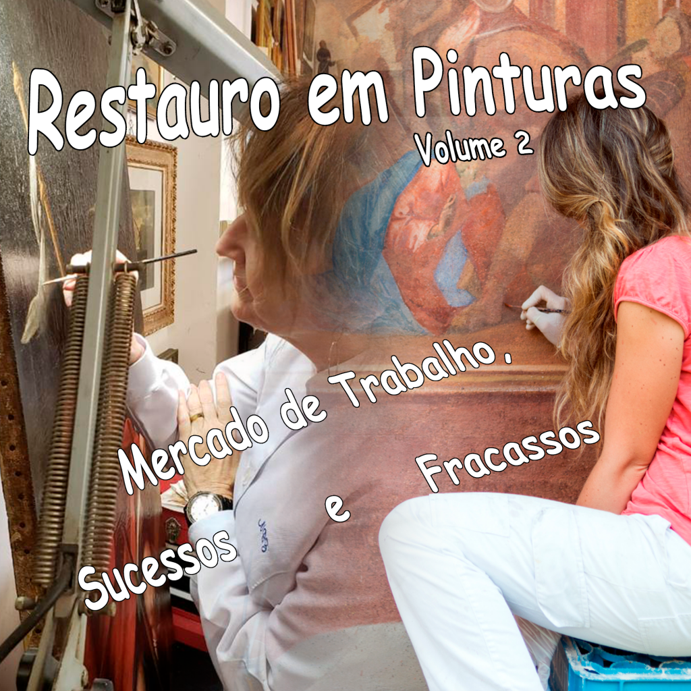

:::: {.texto-justificado}

 

  
  

    Fonte: do autor
  

 

Nas obras artísticas temos uma rica fonte de conhecimento e identidade cultural que espelham a realidade vivenciada em épocas remotas, trazendo novos dados sobre a cultura e tradição desde os povos mais antigos. Em decorrência, a preservação das mesmas, e quando necessário o restauro, é de grande importância para que possamos, no presente, conhecer e entender o passado, mas ao mesmo tempo garantir o acesso das informações às gerações futuras.

---



A conservação e restauro de obras de artes em alguns países é considerado essencial, e em muitos casos são amparados por políticas públicas locais e protegidos por órgãos governamentais, sem contar o inúmero leque de obras protegidas, consideradas como patrimônio mundial, reconhecidas pela UNESCO. Atualmente, muitas obras artísticas apesar de não terem o peso de obras museológicas e reconhecidas podem trazer novos significados culturais e novas descobertas, que eventualmente possam ser tuteladas por museus.

Além da aquisição direta, muitas obras de acervos familiares integram a coleção de museus, através de doações, ou mesmo por empréstimos temporários.

Dentro deste panorama, a conservação de obras artísticas é fundamental. Nestas situações deve-se contar com um controle periódico de manutenção, onde a restauração em si é uma etapa que requer análise e estudos mais dedicados. Dentre as realizações que solidificaram essa área de atuação a teoria do restauro, publicada pela primeira vez por Cesare Brandi (1963), compõe material de relevância e é ponto de partida para quem pretende conhecer com mais detalhes essa atividade. No Brasil temos como destaque a contribuição de Edson Motta. Dentre as muitas atividades que exerceu foi pintor, restaurador e como professor, no campo de conservação de pinturas, publicou dois livros de relevância: “O papel: problemas de conservação e restauro” (1971) e “Iniciação à Pintura” (1976), ambos em parceria com Maria Luiza Guimarães Salgado.

A atuação profissional do restaurador não é regulamentada e a grande maioria é autônoma e trabalha com supervisão ocasional. Por vezes esta atividade requer trabalhar em posições desconfortáveis e sujeitas a materiais tóxicos. O conservador–restaurador pode atuar em instituições públicas, Museus, Bibliotecas, Arquivos, como também em instituições particulares e galerias.

Neste vídeo a engenharia civil e restauradora Nilvea Bugno Zamboni fala a respeito de sua atuação no campo de restauro, da relevância da atividade no âmbito histórico e cultural, da abrangência de conhecimento para garantir e perpetuar a integridade da obra, o que vai muito além da realização do restauro, ou seja, a necessidade de conhecimento do artista, de sua obra e de “suas pinceladas” (o que é quase um registro do traço do artista), e apresenta casos de sucessos, bem como falhas executadas por profissionais amadores, sem as qualificações adequadas.

::::
