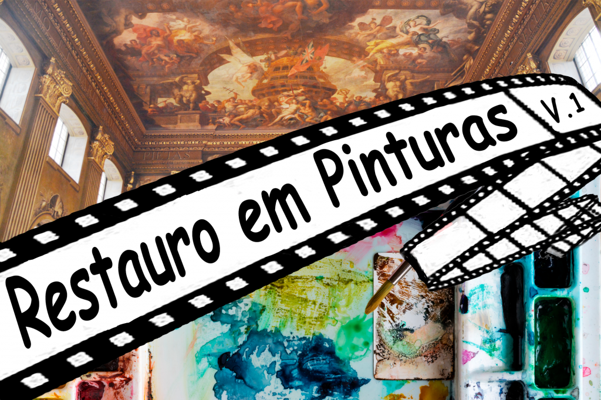

:::: {.texto-justificado}

 

  
  

    Fonte: do autor
  

 

A ideia de recuperar uma obra de arte, que sofreu um dano, surgiu por volta de 1300 na Europa. O restauro, na naquela época, consistia praticamente em “refazer a obra”. Hoje, o conceito de restauração consiste em minimizar essa interferência, e isto pode ser feito com apoio da ciência.

---



Quando se fala que o restauro de uma de obra de arte é feito com apoio da ciência, um dos primeiros aspectos que passou a ser considerado (~1800) na hora de realizar, por exemplo, uma interferência numa pintura, foi à iniciativa de obter informações dos pigmentos utilizados. Posteriormente, por volta do ano de 1813 na Europa, Humphry Davy e Michael Faraday, dão inicio ao emprego de Laboratório portátil de química para investigar pigmentos. Nos anos seguintes surgem os laboratórios em museus. Em 1888 é implantado o primeiro laboratório em Museu na Alemanha no Museu Real de Berlim; em 1920 é implantado o laboratório de Pesquisa no Museu Britânico e em 1928 é implantado o primeiro Laboratório Americano de Pesquisa no Fogg Art Museum (Harvard, Cambridge). Nas décadas seguintes, essa tendência se manteve e hoje a maioria das Instituições que abrigam obras de artes tem instalações laboratoriais  próprias ou utilizam serviços de laboratórios dedicados às investigações de conservação e restauro.

Com o avanço da ciência surgem técnicas que revolucionam a análise de pinturas, como a radiografia. Para dar ideia das informações que se pode obter, quando a tela “A Pedinte Agachada“ de Picasso (1902) foi investigado com radiografia, a análise mostrou a existência de outra pintura, uma paisagem de montanhas. Pela radiografia é possível observar que a paisagem esta virada em cerca de 90 graus, e, que ascostas da mulher foram feitas com o contorno das montanhas.

Uma obra que já passou por vários restauros, é a Ultima Ceia (1485-1498) de Leonardo da Vinci. É uma pintura que foi feita na parede (4,60 por 8,80 metros) do refeitório do convento de Santa Maria delle Grazie em Milão. Para dar ideia das intervenções que a obra já sofreu, foi feita a abertura de uma porta no meio da pintura, pelos padres do monastério no século XVI, fazendo com que os pés de Cristo sumissem. Além disso, durante o domínio de Napoleão (século XIX), o refeitório foi usado como estábulo. Como se não bastasse, durante os bombardeios da Segunda Guerra Mundial (por volta de 1943), o convento foi quase destruído. O telhado e as paredes laterais do refeitório não resistiram, mas a parede pintada ficou protegida por sacos de areia.A obra que vemos hoje é o resultado de um restauro que demorou 20 anos (1979-1999).

Veja no vídeo detalhes de como a ciência foi fundamental para agregar melhorias no ato de restaurar e preservar pinturas artísticas.

::::
