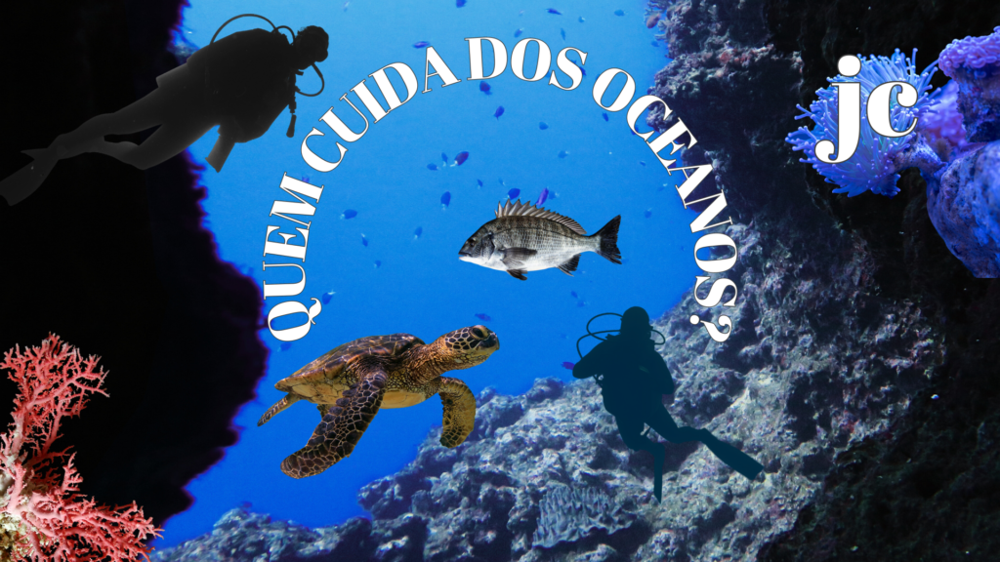
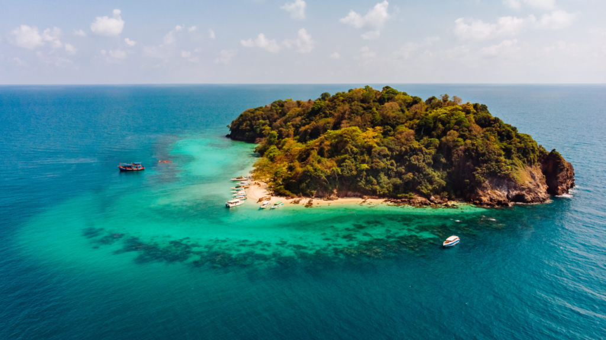

:::: {.texto-justificado}

 

  
  

    Fonte: do autor
  

 

Praticamente toda água do planeta encontra-se nos oceanos (~ 97 %), o equivalente a 71% da superfície terrestre, onde vivem uma infinidade de espécies de animais e vegetais, boa parte ainda desconhecida pelo ser humano. Além disso, conhecer as profundezas dos oceanos ainda é um desafio, pois a pressão das águas esmagaria nosso corpo. O ponto mais fundo já visitado no oceano pacífico (Fossa das Marianas) possibilitou ao ser humano uma visão da vida existente há 11 mil metros abaixo da superfície.

### OCEANOGRAFIA

A oceanografia é a ciência que estuda os mares, rios e oceanos e o oceanógrafo é o profissional que se dedica a entender e preservar nossos oceanos. É considerada uma área recente das ciências. Teve seu início no final do século XIX quando começaram as expedições por várias nações com o intuito de explorar as correntes oceânicas e o fundo do mar. A primeira expedição científica, a Expedição Challenger, foi realizada entre os anos 1872 e 1876 a bordo de um navio de guerra britânico, mas foi com a 2ª Guerra Mundial que o interesse de conhecimento sobre correntes marítimas e vida oceânica aumentou, pois conhecer mais sobre os oceanos poderia apresentar vantagens de combate.

 

  
  

    Ilha no Oceano. Fonte: Flo Dahm, Canva Pro.
  

 

A oceanografia no Brasil nasceu com a cartografia por volta de 1500, por cartas náuticas elaboradas por portugueses para representar os descobrimentos marítimos que realizavam. Em 1508 o roteiro elaborado pelo navegador português Duarte Pacheco Pereira trazia as primeiras informações sobre a costa do Brasil, mas, somente por volta de 1857 foi realizado o primeiro levantamento hidrográfico detalhado da costa brasileira, entre as desembocaduras dos rios Mossoró (RN) e São Francisco (AL/SE), pelo Capitão-de-Fragata Vital de Oliveira.

Um marco importante no âmbito do conhecimento das ciências do mar em território brasileiro ocorreu em 1946, pelo decreto-lei 16.685 de 31 de dezembro, quando o pesquisador Wladimir Besnard foi convidado pelo governo de São Paulo para dirigir o Instituto Paulista de Oceanografia, o qual foi incorporado em 1950 à Universidade de São Paulo, originando o <a href="https://www.io.usp.br/">Instituto Oceanográfico</a> da Universidade de São Paulo. Em sua gestão uniu-se a outros dois cientistas, Ingvar Emilsson e Marta Vannucci, para dar início ao processo de institucionalização das ciências oceanográficas em nosso país. Emilsson formou-se em filosofia pela Universidade de Islândia e realizou seu mestrado e doutorado na Universidade de Oslo, na Noruega, atuando em diversas áreas (matemática pura e aplicada, oceanografia física, ecologia marinha, entre outras) e quando Besnard morreu, em 1960, assumiu a direção do IO-USP e o dirigiu até 1964. Vannucci assumiu a direção do <a href="https://www.io.usp.br/">IO-USP</a> no período de 1964-1969, gestão que possibilitou a finalização da construção do navio oceanográfico (iniciada na gestão de Besnard).

Em 1967 chegou ao Brasil o navio oceanográfico da Universidade de São Paulo “Professor Wladimir Besnard” especialmente construído para essa finalidade na Noruega. Sua incorporação abriu novas possibilidades aos cientistas brasileiros, que passaram a dispor de uma plataforma para navegar em alto mar, dando início aos primeiros cruzeiros oceanográficos na costa do Brasil.

Em 1970 foi criado na Fundação Universidade do Rio Grande (FURG), o <a href="https://io.furg.br/">primeiro curso de graduação em Oceanologia do Brasil</a>. Hoje, cursos de graduação em oceanografia estão disponíveis em várias instituições (públicas e privadas) além de vários cursos de perfil técnico.

A oceanografia se divide em 4 áreas principais: a Biológica que estuda o equilíbrio dos ecossistemas, a Física que estuda as correntes, marés e fenômenos climáticos envolvendo as águas, a Geológica que investiga solo, suas composições, relevos e fenômenos como terremotos e tsunamis a Química que investiga à poluição ambiental e por óleo.  A Profissão de oceanógrafo é regulamentada desde 2008 e no dia 8 de junho se comemora tanto do dia do Oceano como o dia do Oceanógrafo.

Os oceanos compõem a maior parte do nosso planeta e nós ainda não conhecemos nem mesmo 3% do que existe no fundo do mar. O oceanógrafo se dedica a entender e preservar nossos oceanos.

Assista o vídeo e conheça as atividades científicas realizadas pelo pesquisador Edson Gonçalves Moreira, Doutor em Ciências na área de Tecnologia Nuclear, que que atua na área poluição marinha.

---



---

### REFERÊNCIAS

<a href="https://divediscover.whoi.edu/history-of-oceanography/%22%3Ehttps://divediscover.whoi.edu/history-of-oceanography/"> History of Oceanography – Dive Discover </a>  
<a href="https://cienciasdomarbrasil.furg.br/images/livros/LivroIntroducaoCienciasDoMar.pdf"> Introdução às Ciências do Mar – FURG </a>  
<a href="https://cienciasdomarbrasil.furg.br/ensino/graduacao/graduacao-oceanografia"> Graduação Oceanografia – FURG </a>  

::::
