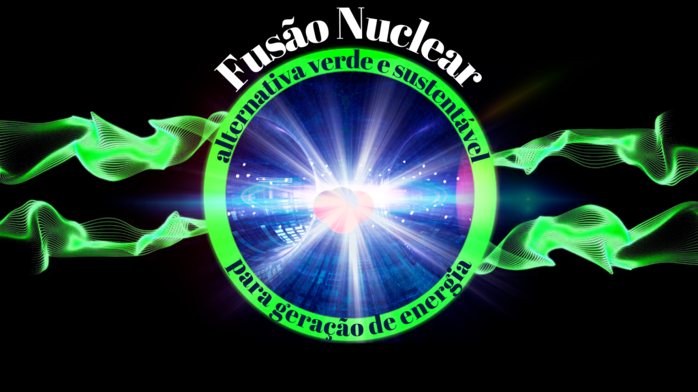
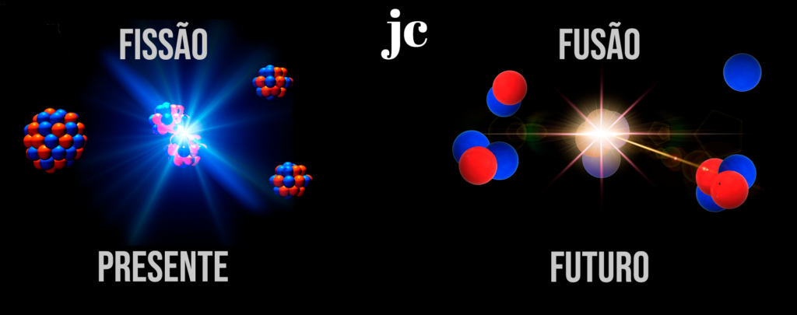
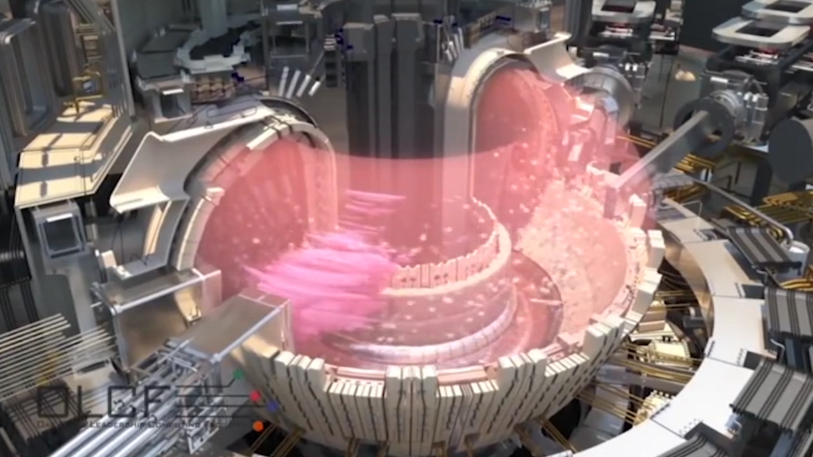
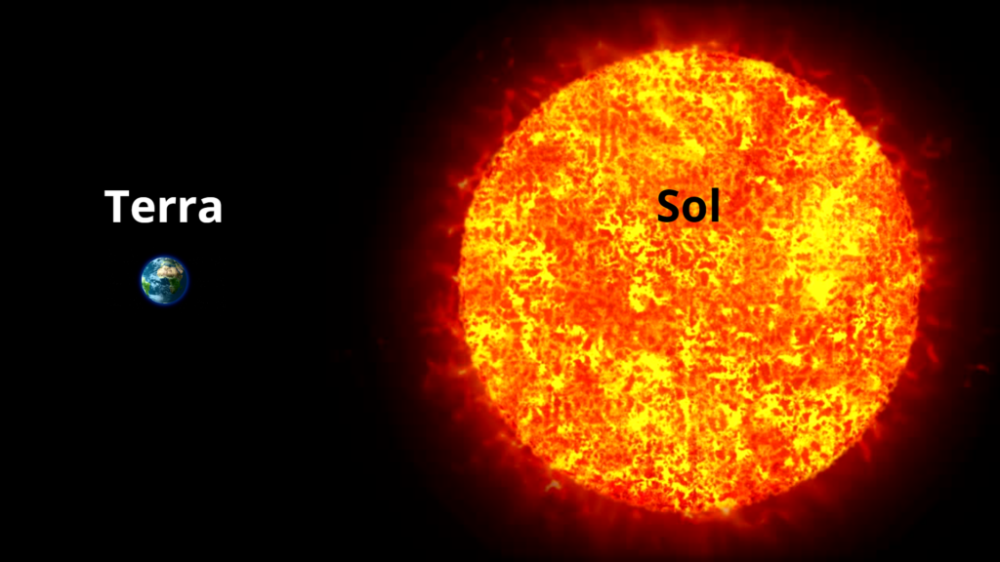
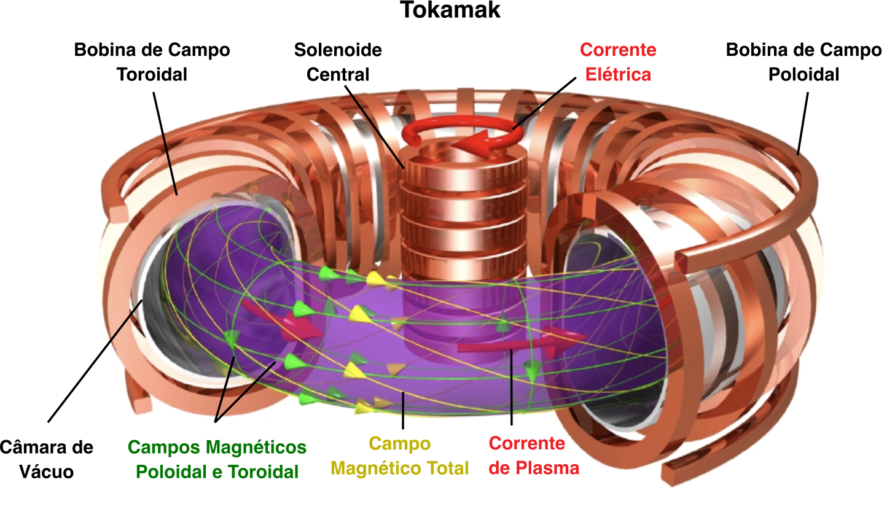
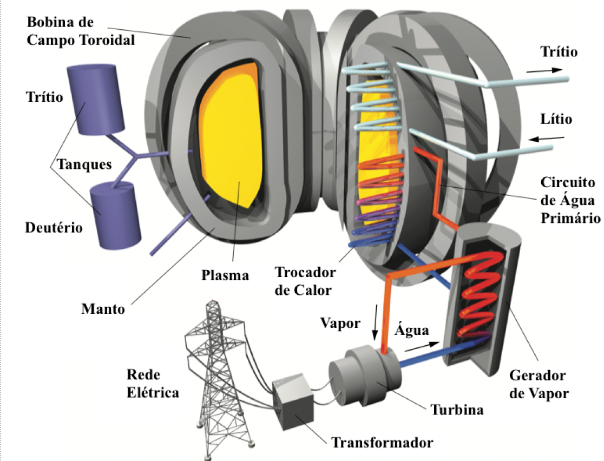
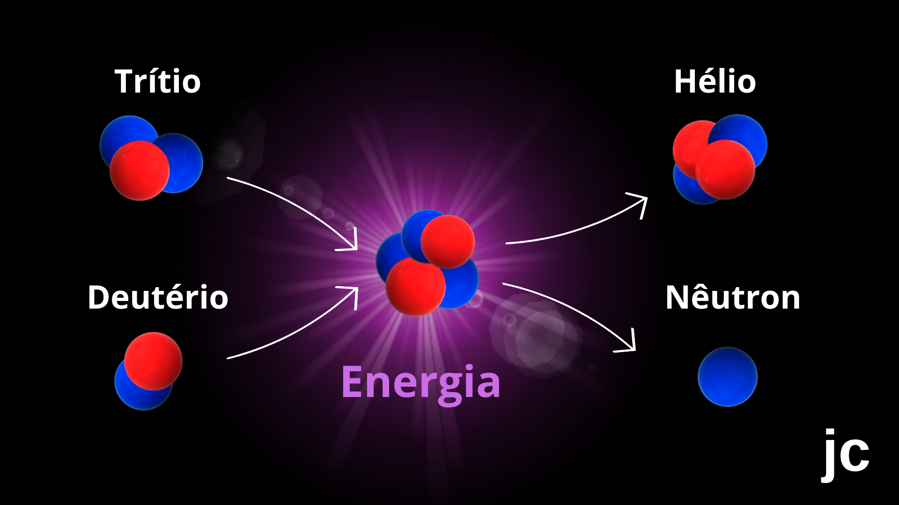
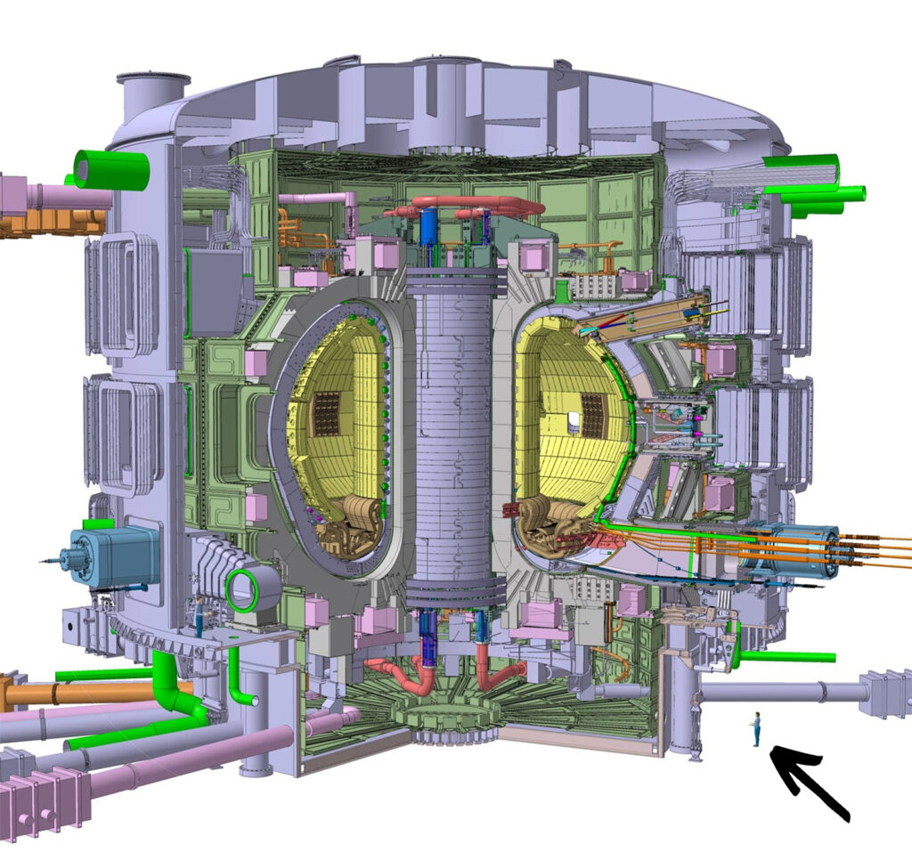

:::: {.texto-justificado}

 

  
  

    Fonte: do autor
  

 

Na <a href="http://jovemcientista.com.br/minuto-nuclear-13-fusao-nuclear/">fusão nuclear (MN#13)</a> átomos pequenos e leves, como o Hidrogênio, se fundem em átomos maiores enquanto na <a href="http://jovemcientista.com.br/minuto-nuclear-07-fissao-nuclear/">fissão (MN#07)</a> átomos grandes e pesados, como o Urânio, se fragmentam em átomos menores (Figura 1). Em ambos os processos ocorre a liberação de energia. No caso da fissão a energia que é liberada pode ser utilizada para produzir eletricidade. Hoje, a energia nuclear proveniente da fissão é responsável pela geração da ordem de 10% da energia elétrica no mundo, sendo de ~ 2,4 % no Brasil (Angra I e Angra II). Já a geração de energia por fusão, embora esteja em estágio tecnológico inicial, pode ser considerada como uma alternativa futura muito promissora, pois é considerada energia verde devido à baixa emissão de gases de estufa e sustentável em função da abundância de combustível que é a base de Hidrogênio. Além disso, a liberação de energia na fusão nuclear é muito superior que na fissão.

 

  
  

    Figura 1: Fusão tecnologia do Futuro. Fonte: jc 2023.
  

 

### Sóis Artificiais

A radiação que vem do Sol alimenta a vida na Terra com calor e luz. Lá no Sol essa radiação é produzida unindo átomos leves como o Hidrogênio pela força gravitacional, processo denominado confinamento gravitacional. Por isso, o Sol pode ser descrito como um gigantesco reator de fusão nuclear. Hoje, ainda não é possível produzir energia elétrica pela fusão, mas aqui na Terra já se avalia fazer fusão usando os <a href="http://jovemcientista.com.br/isotopos-minuto-nuclear-03/">isótopos</a> de Hidrogênio (Deutério e o Trítio) <a href="http://jovemcientista.com.br/isotopos-minuto-nuclear-03/">(MN #03)</a>.

O Hidrogênio tem a vantagem de ser um combustível verde, abundante (que pode durar milhões de anos) e ser mais barato que o Urânio utilizado na fissão (Urânio-235). Além disso, seu isótopo radiativo (o Trítio) gera menos rejeito radioativo, pois sua <a href="http://jovemcientista.com.br/minuto-nuclear-2-meia-vida/">meia-vida</a> (tempo necessario para que a emisão de radiação decaia a metade, <a href="http://jovemcientista.com.br/minuto-nuclear-2-meia-vida/">MN#02</a>) é da odem de 12 anos e, em menor tempo, pode retormar ao meio ambiente de forma segura enquanto os produtos da fissão nuclear permancem emitindo radiação por milhões de anos. Para que aquilo aconteça os cientistas precisam reproduzir em laboratório “sóis artificiais”.

### Reator Experimental Termonuclear Internacional

O <a href="http://www.iter.org/">Reator Experimental Termonuclear Internacional</a> (ITER: International Thermonuclear Experimental Reactor, na sigla em inglês), um protótipo de reator a fusão, já está em construção na França em parceria com 35 países (Figura 2). Este projeto foi iniciado por um tratado de 2006 e envolve a União Europeia de Energia Atômica (EURATOM), Reino Unido, Suíça, Rússia, China, Índia, Japão, Coreia do Sul e Estados Unidos. O Brasil não participa deste consórcio, mas mantém parceria com a EURATOM, na Área de Pesquisa sobre Energia de Fusão, um acordo ratificado pelo Congresso Nacional através do Decreto Legislativo N◦ 587 de 2012.

 

  
  

    Figura 2: Esquema da estrutura e funcionamento do ITER. Fonte: <a href="http://www.iter.org">iter</a>.
  

 

Esse reator tem por objetivo reproduzir a <a href="http://jovemcientista.com.br/minuto-nuclear-14-reator-de-fusao-nuclear/">fusão de Hidrogênio que acontece no Sol</a>. Ocorre que no Sol a força gravitacional é muito forte (~27 vezes maior que na Terra) (Figura 3) e permite que isso aconteça a temperaturas de cerca de 10 milhões de graus Celsius, porém no nosso planeta, com menor gravidade, as temperaturas para produzir a fusão precisariam ser muito altas (acima de 100 milhões de graus Celsius). Portanto, criar um reator que permita unir átomos leves de Deutério e Trítio sem o confinamento por gravidade, como ocorrem nas estrelas, é um dos desafios deste projeto <a href="http://jovemcientista.com.br/minuto-nuclear-14-reator-de-fusao-nuclear/">(MN#14)</a>.

 

  
  

    Figura 3: Gravidade na terra (~10  m/s2) e Gravidade no Sol (~ 270 m/s 2). Fonte: jc 2023.
  

 

O ITER é baseado na tecnologia do Tokamak, um dispositivo experimental com a forma de um <a href="https://pt.wikipedia.org/wiki/Tor%C3%B3ide">toróide</a> (Figura 4), projetado para aprisionar <a href="https://pt.wikipedia.org/wiki/N%C3%BAcleo_at%C3%B3mico">núcleos</a> leves em alta temperatura por  confinamento magnético, o que pode ser obtido utilizando ímãs que geram campos magnéticos intensos. Mas para isso acontecer é necessário obter uma mistura gasosa de Deutério + Trítio (D+T) usualmente denominado plasma. Parece simples, mas requer muitas etapas que necessitam desde a obtenção de Deutério (D) e Trítio (T), como de avanços tecnológicos que envolvem a fabricação de bobinas supercondutoras e materiais resistentes a altas temperaturas sendo dispendioso financeiramente.

 

  

 

 

  
  

    Figura 4: Desenho esquemático de uma forma toroidal e esquema da estrutura de um tokamak. Fonte: Adaptado de <a href="https://ast.wikipedia.org/wiki/Toroide#/media/Ficheru:Simple_Torus.svg">Wikipedia</a> e Tokamak <a href="https://www.gov.br/cnen/pt-br/assunto/pesquisa-desenvolvimento-e-ensino-na-area-nuclear/PropostadeProgramaNacionaldeFusoNuclear2.pdf">gov.br</a>
  

 

O termo Tokamak é uma tradução de uma expressão Russa “toroidalnaya kamera + magnitnaya katushka” que significa câmara toroidal com bobinas magnéticas. Este disposto foi proposto na década de 1950 pelos físicos soviéticos Igor Yevgenyevich Tamm e Andrei Sakharov. Fonte: <a href="www.iter.org">iter</a>.

### Combustível do ITER

O plasma de D+T, que é o combustível para operar o ITER, em parte pode ser extraído da água do mar, como o Deutério que está presente na proporção de 0,001 % na forma de D2O (água pesada). Já o Trítio, que é o isótopo radioativo do Hidrogênio, pode ser obtido em reator nuclear de fissão pela ativação do Lítio com nêutrons e embora seja um componente radioativo os resíduos são de curta duração (décadas).

Para a obtenção do plasma é necessário realizar a ionização dos átomos de D e T, isto é, retirar elétrons desses átomos. Em síntese, para fusão ser realizada no ITER é necessário esquentar o plasma de D+T a temperaturas da ordem de 150 milhões de graus Celsius (de onde vem o termo fusão termonuclear) e controlar sua produção por meio de poderosos ímãs (denominado processo de confinamento magnético) (figura 5 esquerda). Conforme o plasma é aquecido, os núcleos de D e T colidem uns com os outros e se fundem para formar átomos de Hélio (figura 5 direita), liberando nêutrons e muita energia. Esse processo apresentou resultados animadores no Tokamaks JET (Join European Torus) na Inglaterra. O ITER não será capaz de converter a energia de fusão gerada em eletricidade, mas pretende gerar mais energia do que consome.  

 

  

 
 

  
  

    Figura 5: Em um reator de fusão os átomos de Hidrogênio se agrupam para formar átomos de Hélio, nêutrons e grande quantidade de energia que poderá ser utilizada para geração de energia elétrica. Como o Hélio é abundante e não poluente a fusão constitui uma fonte inesgotável e limpa para matriz energética. Fonte: jc 2023 e <a href="https://www.gov.br/cnen/pt-br/assunto/pesquisa-desenvolvimento-e-ensino-na-area-nuclear/PropostadeProgramaNacionaldeFusoNuclear2.pdf">gov.br</a>.
  

 

No ITER tudo é imenso (Figura 6).  A área que abriga o reator tem 30 metros de largura por 30 metros de altura. Os componentes são tão pesados e imensos que algumas estradas e pontes de acesso precisaram ser reforçadas ou ampliadas para que esses componentes chegassem ao canteiro de obras. Para dar ideia, um dos ímãs com aproximadamente 18 metros de altura (pesando da ordem de mil toneladas) quando montado poderá gerar um campo magnético de 280 mil vezes maior que o campo natural da Terra, com capacidade de movimentar, por exemplo, um porta-aviões.

 

  
  

    Figura 6: Esquema comparando a diferença de tamanho entre o Reator de Fusão do ITER e um indivíduo (Seta preta). Fonte: <a href="http://www.fusion.kit.edu/img/ITER_2010.jpg">Fórum Adrenaline</a>.
  

 

### Fusão a Laser

Recentemente, cientistas americanos que trabalham no arsenal de armas nucleares, na Instalação Nacional de Ignição (National Ignition Facilty -NIF, em inglês) do Lawrence Livermore National Laboratory – LLNL, na Califórnia, bombardearam um pequeno cilindro de metal preenchido com Deutério e Trítio com feixes de laser e conseguiram resultados em pequena escala de produtos da reação de fusão. Esses experimentos mostraram viabilidade de fusão a laser, mas a ideia de uma usina de energia de fusão a laser ainda está distante pois o laser da NIF, embora seja o mais potente do mundo, é lento e pouco eficiente para funcionar como um protótipo para a produção de eletricidade, mas sem dúvida é um avanço científico notável.

### Fusão Nuclear no Brasil

O Brasil também tem se dedicado a realizar pesquisas em fusão para possibilitar, no futuro, a produção termonuclear de energia. No Brasil existem três Tokamaks em operação: o TokamaK Chauffage Alfvén Brésilien (TCABR) no Instituto de Física da Universidade de São Paulo (IFUSP), o Experimento Tokamak Esférico (ETE) no Instituto Nacional de Pesquisas Espaciais (INPE) e o Tokamak NOVA-UFES da Universidade Federal do Espírito Santo (UFES) [<a href="http://taniamalheiros-jornalista.blogspot.com/2023/01/">Blog Tania Malheiros</a>]. Desde 2020, pesquisadores atuantes na área de fusão nuclear do IFUSP e do INPE tem-se dedicado a elaborar o Programa Nacional de Fusão Nuclear (PNFN) que prevê a criação do Laboratório de Fusão Nuclear a ser construído em Iperó, SP. Portanto, a perspectiva de realizar o projeto de um laboratório de caráter nacional dedicado ao desenvolvimento e inovação na área de fusão nuclear dá sinais de progresso.

### Futuro com Fusão Nuclear?

O Sol forneceu a receita da fusão nuclear e hoje já sabemos quais são os ingredientes e como devem ser usados. A próxima etapa é adaptá-la à condição de geração de energia. Atualmente, o Tokamak é o conceito mais desenvolvido para geração de plasma termonuclear e, portanto, é o candidato mais promissor para uma futura usina de energia a fusão nuclear.

Do dirigível 14-Bis de Santos Dumont, que 1906 conseguiu voar 220 metros de distância a 8 metros de altura com velocidade de 30 km/h, a construção da Estação Espacial Internacional, iniciada em 1998 e operacional desde 2000 (primeira tripulação), a humanidade mostrou capacidade de evoluir técnica e cientificamente. A fusão controlada em Tokamak é o próximo passo, um desafio em andamento.

O futuro com a fusão controlada prevê geração de energia verde, abundante, sustentável contribuindo com a preservação do meio ambiente.

---



---

### FONTES

<a href="https://www.bbc.com/portuguese/geral-60321276"> BBC Brasil – Fusão nuclear: cientistas anunciam avanço em busca de fonte limpa de energia6a </a>  
<a href="http://taniamalheiros-jornalista.blogspot.com/2023/01/"> Blog Jornalista Tania Malheiros – Fusão Nuclear </a>  
<a href="https://canaltech.com.br/ciencia/qual-a-diferenca-entre-fissao-e-fusao-nuclear-212541/"> Canaltech – Qual é a diferença entre fissão e fusão nuclear? </a>  
<a href="https://pris.iaea.org/PRIS/CountryStatistics/CountryDetails.aspx?current=BR"> IAEA – Power Reactor Information System </a>  
<a href="https://www.nationalgeographicbrasil.com/meio-ambiente/2022/08/fusao-nuclear-o-que-e-e-como-ela-pode-ajudar-o-planeta"> National Geographic Brasil – Fusão nuclear o que é e como ela- pode ajudar o planeta. </a>  
<a href="https://olhardigital.com.br/2022/02/09/ciencia-e-espaco/cientistas-europeus-estabelecem-novo-recorde-em-fusao-nuclear/"> Olhar Digital -Cientistas europeus estabelecem novo recorde em fusão nuclear </a>  
<a href="https://www.gov.br/cnen/pt-br/assunto/pesquisa-desenvolvimento-e-ensino-na-area-nuclear/PropostadeProgramaNacionaldeFusoNuclear2.pdf"> Proposta de Programa Nacional de Fusão Nuclear – CNEN </a>  
<a href="https://www.iter.org/glossary"> Reator Experimental Termonuclear Internacional – Glossário </a>  

::::
