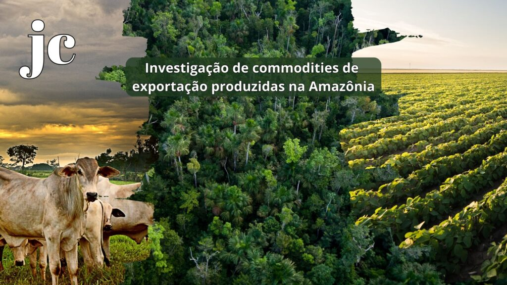

:::: {.texto-justificado}

 

  
  

    Fonte: do autor
  

 

A Floresta Amazônica é a maior floresta tropical do mundo.  Localiza-se na América do Sul, com área de 6,7 milhões de km², distribuídos por nove países, sendo que quase 62% de sua extensão fica no Brasil. Para se ter ideia de sua dimensão, os rios amazônicos lançam da ordem 175 milhões de litros de água por segundo e da ordem de 10% de todas as espécies de plantas, bem como 10% de animais existentes no mundo, fazem parte da flora e da fauna amazônica.

Os problemas ambientais na Floresta Amazônica têm se agravado nos últimos anos. As principais ameaças são o garimpo, a extração ilegal de madeira, o crescimento de áreas mineração e o crescimento das áreas destinadas aos cultivos agrícolas e às pastagens, além do aumento das queimadas e desmatamento que já chega a 800 mil km² de cobertura nativa.

O Projeto Temático “Transparência nas cadeias produtivas brasileiras de commodities agrícolas de exportação: estudo holístico de marcadores elementares e isotópicos” que tem apoio da FAPESP, pretender propor soluções que podem auxiliar na preservação. Dentre os objetivos do projeto pretende-se caracterizar a madeira que é extraída legalmente, a soja cultivada e a carne bovina produzida na região utilizando diferentes metodologias analíticas.

Essas commodities de exportação serão submetidas ao estudo holístico de marcadores elementares e isotópicos possibilitando sua rastreabilidade inibindo ações ilícitas.

Preservar a Floresta Amazônica é fundamental para manutenção do clima e para o equilíbrio ambiental do planeta. Veja o vídeo e conheça detalhes deste projeto.

---



::::
