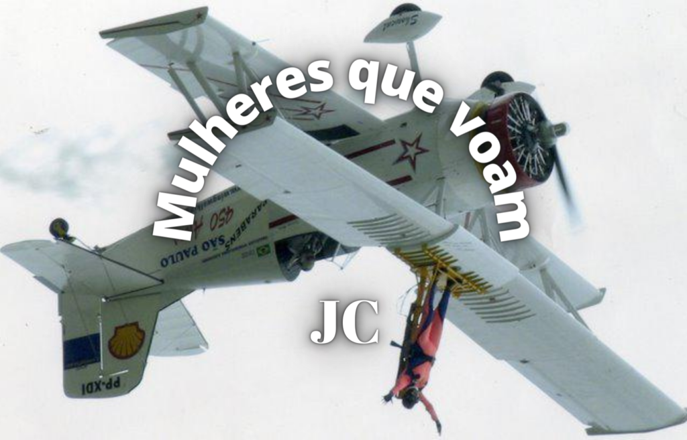

:::: {.texto-justificado}

 

  
  

    Fonte: do autor
  

 

O surgimento do avião no início do século XX foi um marco tecnológico para a humanidade. Primeiro foram os balões e zepelins que conseguiam se colocar no céu, mas ainda não tinham autonomia para voar. Depois, com os irmãos Wright e Santos Dumont esta barreira foi alcançada embora, até hoje, haja controvérsias pela criação do avião. Em 1903 os irmãos norte-americanos Wilbur e Orville Wright conduziram um voo em aeronave motorizada sem capacidade técnica de executar decolagem, isto é, para que o voo fosse possível eles utilizaram uma catapulta. Já o 14-Bis de Santos Dumont decolou com autonomia, fato que o coloca como sendo o 1º voo do mundo.

Hoje a humanidade já realiza viagens espaciais, mas para entender esta conquista é interessante lembrar o contexto histórico desde que o homem passou a querer asas tecnológicas para voar rumo ao espaço. É preciso voltar até o fim da Segunda Guerra Mundial, em 1945, período em que se iniciou uma disputa político-ideológica entre os Estados Unidos e a antiga União Soviética (URSS), nações que lideravam os blocos econômicos. No final da década de 1950, época em que a bipolarização mundial entre essas superpotências se acentuavam, a corrida espacial deu destaque inicialmente aos soviéticos, pois foram os primeiros a enviar satélite, animal, homem e mulher ao espaço antes que os americanos.

O ano é 1957 e tem início a exploração espacial pelos soviéticos ao lançaram o primeiro satélite artificial para a órbita terrestre, o Sputnik 1. O satélite era uma esfera metálica de 58cm de diâmetro com quatro antenas para a transmissão de sinais de rádio que podiam ser identificados até por radioamadores. Os sinais foram emitidos por mais de 20 dias, até o término da carga das baterias. No mesmo ano a cadela Laika faz a primeira viagem para o espaço abordo de outro satélite soviético, o Sputnik 2, tornando se o primeiro ser vivo em viagem ao espaço. Com foguetes aprimorados foram realizadas outras missões, como o envio do Sputnik 5, que levou os cães Belka e Strelka para a órbita terrestre em março de 1961 e os trouxe de volta em segurança. Com este sucesso os soviéticos criaram o programa Vostok, que abriu o caminho para levar o primeiro humano ao espaço.

Em abril de 1961 é a vez de o cosmonauta Yuri Gagarin, 27 anos, fazer a primeira viagem espacial com recursos técnicos um tanto limitados de comunicação, como rádio VHF (sigla para o termo inglês Very High Frequency; em português Frequência Muito Alta) e o telegrafo. Gagarin após ficar em órbita por aproximadamente 108 minutos, seu retorno se deu com sucesso, mas ele precisou improvisar um pouco. Após chegar ao solo terrestre há quase 280 km de distância do local previsto, próximo a uma fazenda, fez uso da comunicação possível à época: caminhou até a fazenda e solicitou ao proprietário (um tanto surpreso com seus trajes espaciais) o uso de seu telefone para comunicar Moscou de sua chegada, bem como sua localização.

### Primeira mulher no espaço

Em junho de 1963 a primeira mulher vai ao espaço. A russa Valentina Tereshkova com 26 anos tripulou a Vostok VI permanecendo no espaço por quase três dias, mas seu retorno foi um pouco complicado. Ela seguiu o planejado ejetando-se da cápsula com paraquedas quando alcançou altitude adequada (nos primeiros voos as naves possuíam um paraquedas para descida após a reentrada, além disso os cosmonautas tinham que saltar da nave, antes da aterrissagem, usando o seu próprio paraquedas). O correu que, devido aos ventos fortes sua descida foi muito desgastante fisicamente, mas ela conseguiu aterrissar próximo à região fronteiriça do atual Cazaquistão com a Mongólia e a China. Tereshkova teve ajuda de moradores locais para tirar o traje espacial e o convite de jantar na companhia deles (que aceitou), o que lhe rendeu uma advertência, pois ela deveria ter feito exames médicos primeiro.

Valentina Tereshkova nunca havia pensado em tornar-se cosmonauta. Filha de uma família de camponeses, aos 16 anos abandonou a escola e foi trabalhar em uma fábrica para ajudar no sustento da casa. Aos 22 anos ingressou na escola de paraquedismo e, sem permissão do instrutor, fez seu primeiro salto, e muitos outros (mais de 100 com permissão). Filiada ao Partido Comunista teve conhecimento de um Programa de Governo que tinha por objetivo enviar mulheres para o espaço. Ela decidiu fazer sua inscrição no Programa, que era um segredo de Estado, por isso nem seus familiares tinham conhecimento de sua decisão. Após sete meses de rigoroso treinamento Valentina Tereshkova e a também candidata Valentina Ponomaryova foram escolhidas para realizar as missões no Vostok 5 e Vostok 6, respectivamente. Entretanto, Ponomaryova foi substituída por um cosmonauta (acredita-se que isto se deu em função de suas posições feministas) e Tereshkova foi remanejada para o Vostok 6. Valentina Tereshkova foi escolhida pelo primeiro-secretário do Partido Comunista da União Soviética e governante do país Nikita Kruschev, pois era uma figura ideal para a propaganda soviética à época, isto é, era devotada ao Partido Comunista, tinha uma origem humilde e experiência com paraquedismo.

A segunda mulher a ir ao espaço também foi uma cosmonauta soviética, Svetlana Savitskaya, em 1982 na missão Soyuz T-7. Só no ano seguinte os Estados Unidos enviaram a primeira americana ao espaço, a astronauta Sally Ride a bordo da espaçonave Challenger. Desde então dezenas de mulheres já viajaram ao espaço. Além de soviéticas e americanas, também canadenses, chinesas, japonesas, bem como da França, da Índia, da Itália, da Coreia do Sul e do Reino Unido já participaram de viagens espaciais. Recentemente, em 2021, a aviadora americana Mary Wallace Funk com 82 anos, “Wally Funk” como ficou conhecida, foi ao espaço no primeiro voo tripulado da Blue Origin como convidada e se depender dela ira para Lua, só está esperando o próximo convite. O foguete chegou a 107 km de altitude, portanto acima da linha de Kárman (100 km acima do nível do mar), que é considerado o limite entre a atmosfera e o espaço. Em sua carreira de aviadora ela realizou mais de 19 mil horas de voo, mas precisou ser persistente para chegar a este feito. Teve sua primeira aula de voo aos nove anos e conseguiu obter sua licença de piloto, mas não foi autorizada a cursar a disciplina de mecânica, pois era disponibilizada somente para homens. Além disso, por quatro vezes, tentou se tornar astronauta pela NASA, mas foi rejeitada por não ser formada em engenharia e não ter voos em caças, o que também não era permitido as mulheres, à época.  Ainda, em 2021, a primeira mulher astronauta nos Emirados Árabes Noura Al-Matrooshi foi contratada pelo programa de astronautas do Centro Espacial Mohammed Bin Rashid (MBR) dos Emirados Árabes Unidos e fará treinos com a NASA para futuras explorações espaciais.

### Mulheres na Estação Espacial Internacional (ISS)

As astronautas também estão na Estação Espacial Internacional (EEI, na sigla em português) ou International Space Station (ISS na sigla em inglês). A ISS é um laboratório no espaço que realização experimentos em ambiente de baixa gravidade. Encontra-se a uma altitude de aproximadamente 400 quilômetros da superfície terrestre, uma órbita designada como de baixa altitude, motivo pelo qual a estação precisa ser constantemente reposicionada. Com 109 metros de largura, 73 metros de comprimento, 20 metros de altura e massa de aproximadamente 450 toneladas, a estação circula a Terra 16 vezes por dia com velocidade da ordem de 8 km/s.  Sua montagem teve início em 1998 e foi oficialmente concluída 2011. A localização da ISS pode ser monitorada pelo site <a href="https://www.astroviewer.net/iss/pt/">astroviewer</a>.

A primeira comandante da ISS foi Peggy Annette Whitson, em 2007, que recebeu a colega Pamela Anne Melroy, comandante do ônibus espacial Discovery, sendo a primeira vez que duas mulheres comandavam, ao mesmo tempo, operações no espaço e não foi uma jogada de marketing da NASA. A reunião das duas astronautas americanas no espaço foi coincidência, pois Melroy deveria estar em órbita antes de Whitson assumir o comando da ISS, mas os atrasos nos voos dos ônibus espaciais levaram a este acaso. As viagens espaciais para ISS continuaram em 2021 e quem foi para o espaço desta vez foi a atriz russa Yulia Peresild, que passou 12 dias hospedada nas ISS, para filmar “The Challenger” (O Desafio), a primeira filmagem cinematográfica realizada fora do planeta. Para 2022 está previsto que a astronauta italiana Samantha Cristoforetti será a primeira mulher europeia a assumir o comando da Estação Espacial Internacional.  Ela tem 500 horas de voo em seis tipos diferentes de aviões militares e é a primeira mulher a chegar ao posto de capitã da aviação militar e de piloto de caça na Itália. Em edição espacial da boneca Barbie a astronauta Cristoforetti deu corpo a “Barbie Astronauta” para inspirar meninas a seguir carreiras ligadas às ciências espaciais. Ainda, em outubro de 2021 decolou do Centro de Lançamento de Jiuquan a espaçonave chinesa Shenzhou 13, com destino a futura Estação Espacial Tiangong (TSS), tripulada por três taikonautas (como são chamados os astronautas chineses), dentre eles a taikonauta Wang Yaping que já realizou caminhada espacial para instalação de cabos, tarefa considerada de alto risco. 

### Mas quem será a primeira mulher a ir a Lua?

A astronauta Christina Hammock Koch é uma das candidatas. A NASA já deu início ao programa que pretende levar novos astronautas à superfície da Lua. A missão Artemis já está em preparação com 18 profissionais dos quais Koch e mais 7 são mulheres. Koch se tornou a mulher há passar mais tempo no espaço, 328 dias. Ela deixou a Terra em 14 de março de 2019 e aterrissou no Cazaquistão em 6 de fevereiro de 2020. O recorde anterior era de Peggy Whitson, 289 dias. Ainda, em outubro de 2019, Koch juntamente com a astronauta Jessica Ulrika Meir protagonizaram a primeira caminhada espacial 100% feminina.  Embora o primeiro passeio espacial feito exclusivamente por mulheres tenha sido inicialmente programado para março de 2019, a NASA teve que cancelar a operação porque, alguns dias antes, constatou que não tinha trajes do tamanho adequado para as duas astronautas (Christina Hammock Koch e Anne McClain). Como só havia um traje espacial (no tamanho adequado) Koch participou da missão com o astronauta Nick Hague. Antes disso, mulheres já haviam participado desta operação, mas em parceria com homens.

### Pioneiras no espaço aéreo Brasileiro

Ainda não temos nossa astronauta brasileira, mas temos mulheres na aviação desde 1922 quando Thereza de Marzo (aos 18 anos) e Anésia Pinheiro Machado (aos 17 anos) realizam voos solo no mesmo dia. A terceira mulher a obter uma licença de piloto de avião foi Ada Rogato em 1936. Rogato foi a primeira mulher a pilotar um planador, a primeira pilota agrícola e primeira paraquedista do Brasil. Hoje já são centenas de pilotas de aeronaves e algumas, que não pilotam, usam a criativa para voar como Marta Lucia Bognar, a primeira mulher no Brasil a praticar wingwalker. Assista ao vídeo e conheça um pouco mais dessas mulheres que voam.

---



::::
