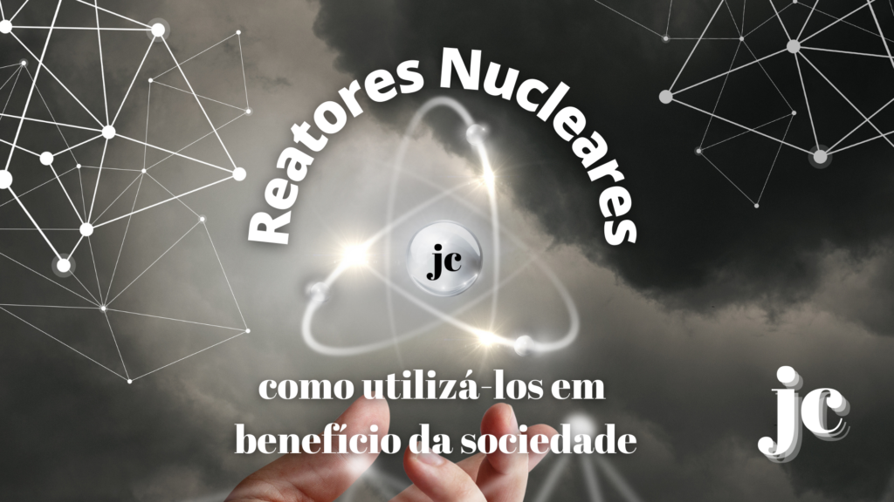
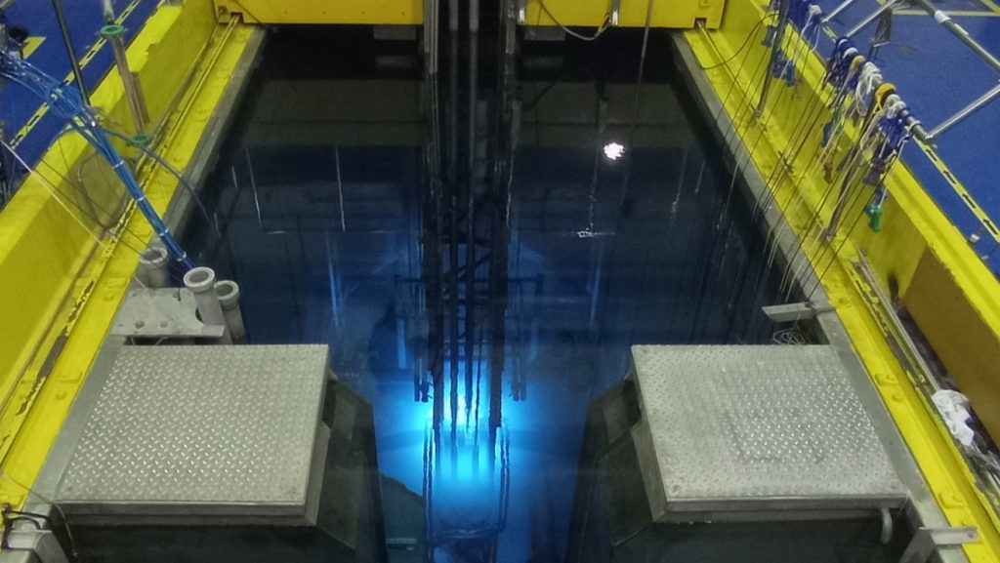
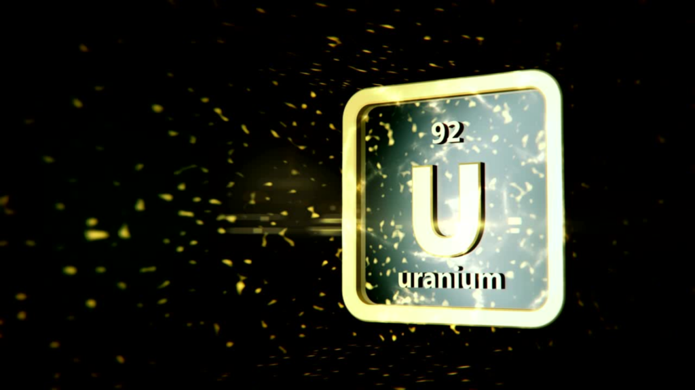
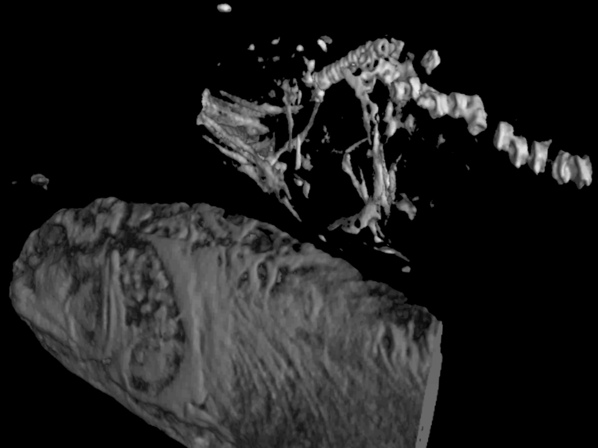
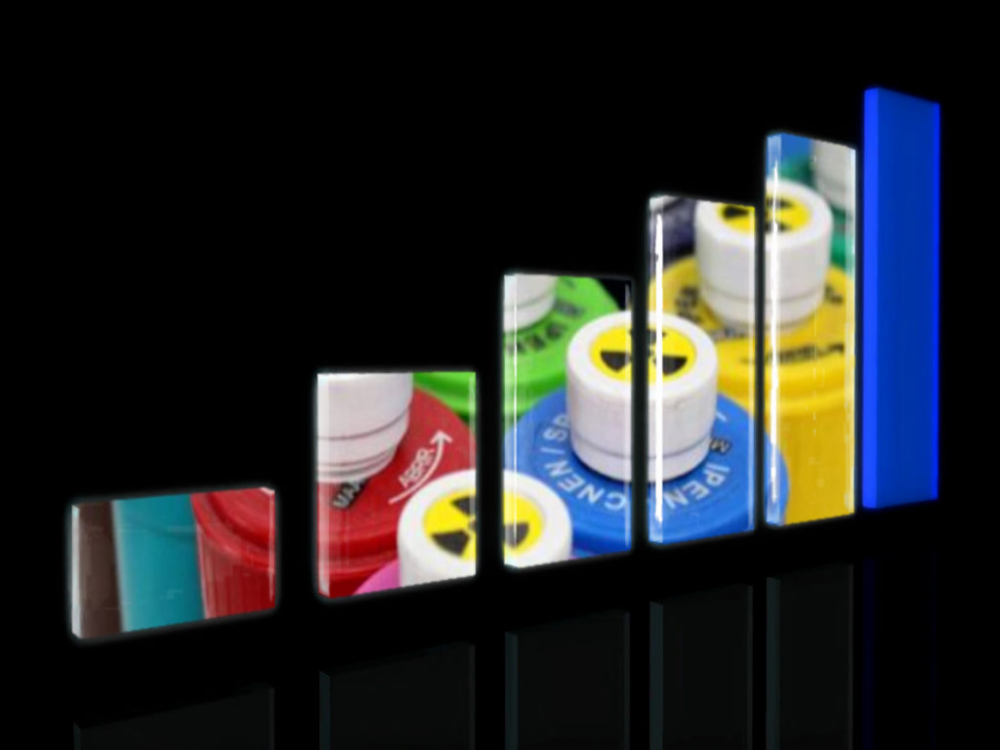

:::: {.texto-justificado}

 

  
  

    Fonte: do autor
  

 

Uma ideia bastante próxima da realidade é visualizar um reator nuclear como sendo uma infraestrutura que produz nêutrons de forma controlada. Basicamente existem três tipos de reatores nucleares: de POTÊNCIA, para produção de energia elétrica, de PESQUISA, para geração de conhecimento e reatores para PROPULSÃO NAVAL, que são utilizados em porta-aviões, navios quebra gelo e submarinos, que somam mais de 300 no mundo. No Brasil, a Marinha está construindo o Laboratório de Geração Nucleoelétrica (LABGENE), um protótipo (em terra) da planta nuclear do futuro submarino brasileiro com propulsão nuclear (SN-BR).

Atualmente estão em operação 442 reatores nucleares para geração de energia (usinas nucleares) instalados em 30 países. Esses reatores são responsáveis por ~16% da energia elétrica gerada no mundo. Brasil e Argentina são os únicos países na Americana do Sul que possuem reatores nucleares de potência. No Brasil há duas usinas em atividade (Angra 1 e Angra 2) e uma em construção (Angra 3), enquanto na Argentina há três em operação (Atucha-1, Atucha-2 e Embalse) e uma em construção (Carem25). No Brasil essas usinas nucleares representam quase 3% da matriz energética. Brasil e Argentina também possuem Reatores de Pesquisa, quatro e sete respectivamente, que são dedicados à geração de conhecimento e aplicações diversas. No Brasil são dois reatores instalados em São Paulo (IEA-R1 de 5MW e MB-01 de 100kW), um em Belo Horizonte (IPR-R1 de 100kW) e um no Rio de Janeiro (Argonauta de 500W), sendo o reator IEA-R1 o de maior porte e um dos mais antigos em operação no mundo.

### Reator de Pesquisa IEA-R1 

 

  
  

    Piscina do Reator IEA-R1 IPEN/CNEN-SP Foto: Dalton Giovanni 2022
  

 

O Reator IEA-R1 entrou em operação em 1958 e nessas décadas de funcionamento vem se modernizando e se adaptando às normas de segurança, o que tem possibilitado seu uso continuado e produtivo. Este reator foi construído em parceria com o governo norte-americano, dentro do programa Átomos para Paz, que tinha por objetivo estimular os países a conhecer e utilizar tecnologia nuclear na medicina, na agricultura e para a geração de energia elétrica. Esse programa forneceu a base para a criação da Agência Internacional de Energia Atômica (AIEA) e para o Tratado de Não Proliferação de Armas Nucleares (TNP).

Instalado no Instituto de Pesquisas Energéticas e Nucleares (IPEN), na Cidade Universitária (campus da USP-SP), este reator é do tipo piscina (9m de profundidade, 3m de largura e 10m de comprimento) a qual é preenchida com 273 m3 de água desmineralizada.  Este reator utiliza combustível nuclear de urânio, enriquecido a 20% no isótopo de urânio-235 (isótopo radioativo de urânio), fabricado no IPEN e opera a uma potência máxima de 5 MW.

### Como funciona este reator nuclear?

 

  
  

    Fonte: do autor
  

 

O Reator IEA-R1 é um reator de fissão, pois seu combustível possui urânio-235 (físsil). A fissão é um processo que leva à divisão do núcleo de um elemento químico pesado (neste caso o urânio-235 do combustível) em dois outros elementos mais leves com a decorrente emissão de nêutrons. Sua concepção pode gerar feixe de nêutrons de até 1013 n.cm-2.s-1. Este processo de fissão nuclear controlada não libera gases estufa e não tem interferência de fatores climáticos, como ventos e chuvas. Além disso, o Brasil tem grande disponibilidade de urânio (uma das maiores reservas no mundo), o que facilita suprir a demanda de combustível, além de ter desenvolvido o conhecimento de produzir o combustível nuclear.

### O que se pode fazer em benefício da sociedade usando nêutrons

O feixe de nêutrons gerados pelo reator de pesquisa IEA-R1 atende há mais de 60 anos a comunidade científica, fornecendo instalações para a realização de pesquisas básica e aplicada, o que já resultou em benefícios significativos nas áreas da saúde, indústria, agricultura e meio ambiente.

### Radioisótopos e Radiofármacos

O reator IEA-R1 produz vários radioisótopos, tais como, Samário-153, Irídio-192 e Iodo-131, e os transforma em radiofármacos (remédios com componente radiativo) para uso em medicina nuclear para diagnóstico, tratamento de câncer e outras doenças, além de investir em pesquisas direcionadas à produção de outros radioisótopos. Produz, também, fios e sementes radioativas de para uso em braquiterapia, um tratamento para o câncer de próstata. As sementes são feitas de cápsulas de titânio (0,8mm de diâmetro externo, 0,05mm de espessura de parede e 4,5mm de comprimento) e acomodam, em seu interior, o material radioativo. As sementes são implantadas na região do tumor, resultando em um tipo procedimento não cirúrgico, poupando tecidos sadios além de menor incidência de efeitos colaterais como impotência e incontinência urinária comparada aos tratamentos convencionais. Atualmente, da ordem de 10.000 hospitais no mundo usam radioisótopos para realizar mais de 30 milhões de procedimentos médicos por ano, dos quais ~ 2 milhões são realizados no Brasil, entretanto, isso representa somente um terço dos atendimentos, o que requer a importação de radioisótopos para atender toda a demanda nacional.

A produção de radioisótopos também atende a agricultura, fornecendo traçadores radioativos (substâncias marcadas com um átomo radioativo), por exemplo, para uso na eliminação de pragas por meio dos predadores naturais, sem o uso de inseticidas; para uso nos segmentos industriais de óleo e gás, de alimentos e quimica, e tambem para monitoração de danos ao meio ambiente, pelo rastreamento de poluentes no ar, em rios e solos.

O uso de nêutrons também possibilita a prestação de serviços para a produção e calibração de fontes radioativas utilizadas em processos industriais e na medicina nuclear, bem como a identificação e quantificação de metais pesados pela ativação com nêutrons que, em função de sua versatilidade, é aplicável em materiais diversos (biológicos, metálicos, alimentícios, dentre outros).

### Neutrongrafia

 

  
  

    Fonte: do autor
  

 

Além da produção e comercialização de radiofármacos e traçadores radioativos, outras aplicações são realizadas utilizando feixe de nêutrons, como a Neutrongrafia. Esta técnica radiográfica possibilita a inspeção por imagem em 3D, que permite verificar fissuras e defeitos em peças, soldas de componentes metálicos, sendo de grande utilidade para várias indústrias, como naval, aeronáutica, automobilística e petrolífera, bem como para investigações arqueológicas e paleontológicas.

### Irradiação de Silício e Gemas

A irradiação com nêutrons de tarugos de Silício, que é um material empregado em chips e fibras ópticas, também traz benefícios para a indústria de eletroeletrônicos, pois torna suas propriedades elétricas mais eficientes, agregando melhorias a esses produtos. Seu consumo mundial é de milhões toneladas por ano e os fornecedores tem dificuldade em atender a demanda. Da mesma forma, a irradiação de gemas com nêutrons proporciona colorido mais intenso, atribuindo maior valor as joias, um mercado em expansão mundial e ainda pouco explorado.

No âmbito de atividades promissores, para ampliar as aplicações no reator IEA-R1, tem-se o uso da difração de nêutrons para identificar deformidades (a nível de estrutura atômica e molecular) em materiais usados na indústria, e o uso da Terapia de Captura de Nêutrons por Boro para tratamento de câncer, procedimentos já amplamente utilizados em reatores de pesquisas do mundo.

Outro ponto a descartar é a formação de recursos humanos, que gera perspectivas diferenciadas do uso de nêutrons, bem como o treinamento e qualificação de profissionais e técnicos.

### Reatores Nucleares: futuro

No mundo já foram construídos 660 reatores de pesquisa, sendo que 242 estão em operação, 7 em construção e 6 em planejamento. O Brasil já deu início ao projeto do Reator Multipropósito Brasileiro (RMB), um reator do tipo piscina, com uma potência de até 30 MW, que comparativamente ao IEA-R1 (5MW) acrescentara um potencial significante de maior desempenho e produtividade. O RMB será construído em Iperó, uma área de dois milhões de metros quadrados, junto ao Centro Experimental de ARAMAR da Marinha Brasileira, cujo projeto detalhado de engenharia já foi concluído. A área disponibilizada para sua instalação é aberta à visitação, onde já foi realizado um trabalho de reflorestamento. Assim como no reator IEA-R1, o combustível será uranio enriquecido à ~20% de uranio 235, fornecido pelo Centro Tecnológico da Marinha em São Paulo (CTMSP). É relevante ressaltar que essa concentração está de acordo com o tratado de não proliferação de armas nucleares (TNP).

 

  
  

    Expectativa de aumento de Radiofármacos com a criação do Reator RMB. Foto: Adaptado de Canva Pro e Vocativo.
  

 

O RMB vai dar autonomia ao Brasil no fornecimento de radiofármacos, garantindo a produção e o atendimento da demanda nacional, o que vai minimizar gastos com a importação de radioisótopos. Além disso, o excedente da produção poderá ser exportado, pois existem poucos reatores desse porte no mundo para atender à crescente demanda por radioisótopos.  Além disso, por ser uma infraestrutura que permite a realização de vários propósitos simultaneamente, paralelamente a produção de radioisótopos, este reator poderá fornecer condições de ampliar a capacidade de execução de produtos e serviços para diversas áreas como, medicina, indústria, meio ambiente, ciência de materiais, ciências forenses, bem como viabilizar a realização de teste de materiais e de combustíveis nucleares, aumentando a oportunidade de empregos, além de possibilitar novos rumos para as ciências nucleares

Conhecer o potencial uso dos reatores de pesquisa permite escolhas benéficas do uso da energia nuclear.

---



---

### FONTES

<a href="http://abrahao-radiologia.blogspot.com/2016/03/a-neutrongrafia-como-novo-metodo-de.html"> Abrahão Radiologia – Neutrografia </a>  
<a href="https://cursosextensao.usp.br/pluginfile.php/141621/mod_resource/content/1/Dicionario-Mineralogia-Gemologia-2ed-DEG.pdf"> BRANCO, Pércio de Moraes. Dicionário de Mineralogia e Gemologia. São Paulo: Oficina de Textos, 2008. 608 p. il. </a>  
<a href="https://rbc.inca.gov.br/index.php/revista/article/view/2439/1518"> Campos TPR de. Considerações Sobre a Terapia de Captura de Nêutrons pelo Boro. Rev. Bras. Cancerol, 2000. 46(3):283-92. </a>  
<a href="https://www.gov.br/cnen/pt-br/rmb/o-reator-multiproposito-brasileiro-rmb"> CNEN – O Reator Multipropósito Brasileiro – RMB </a>  
<a href=""> FAVACHO, Maurício et al. Tratamento em gemas. In: CASTAÑEDA, Cristiane et al. Gemas de Minas Gerais. Belo Horizonte, Soc. Bras. de Geologia, 2001. 80 p. il. p. 5-73 </a>  
<a href="https://www1.folha.uol.com.br/ciencia/2008/01/366928-ha-50-anos-brasil-inaugurava-primeiro-reator-nuclear-da-america-latina.shtml"> Folha de São Paulo – há 50 anos o Brasil Inaugurava o primeiro reator nuclear da América Latina </a>  
<a href="https://dportal.ipen.br/portal_por/portal/interna.php?secao_id=2478"> IPEN – Difração de Nêutrons </a>  
<a href="https://www.ipen.br/portal_por/conteudo/institucional/arquivos/ipen-produtos_servicos_comercializados.pdf"> IPEN – Radiofármacos comercializados pelo IPEN/CNEN </a>  
<a href="https://www.ipen.br/portal_por/portal/interna.php?secao_id=729"> IPEN – Reator IEA-R1 </a>  
<a href="https://www.marinha.mil.br/dgdntm/sites/www.marinha.mil.br.dgdntm/files/arquivos/LABGENE_%20Conhecendo%20a%20planta%20nuclear%20do%20Submarino%20de%20propuls%C3%A3o%20Nuclear%20brasileiro.pdf"> Marinha do Brasil – Submarino de propulsão Nuclear brasileiro </a>  
<a href="http://repositorio.ipen.br/handle/123456789/28166."> PEREIRA, MARCO A.S. Imageamento com nêutrons: 30 anos de atividades no IPEN-CNEN/SP. São Paulo: s.n., 2017. 205 p. </a>  
<a href="http://www.cprm.gov.br/publique/SGB-Divulga/Canal-Escola/Gemas-Tratadas-1277.html"> Serviço Geológico do Brasil – CPRM – Gemas Tratadas </a>  
<a href="https://super.abril.com.br/tecnologia/o-micromundo-dos-chips/"> Super interessante – O micromundo dos chips </a>  

::::
