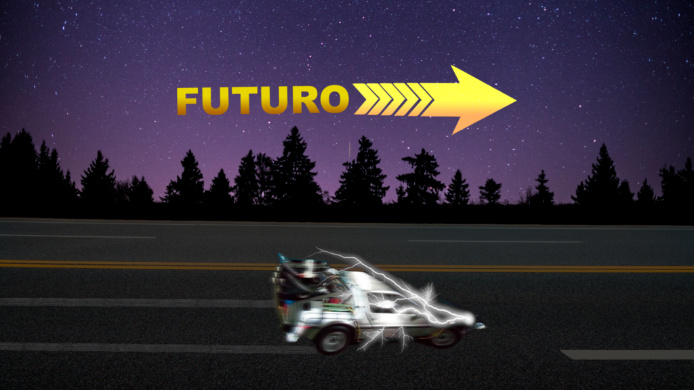

:::: {.texto-justificado}

 

  
  

    Fonte: do autor
  

 

No primeiro filme da trilogia De Volta para Futuro, o Delorean (carro transformado em máquina do tempo pelo Dr Emmett Brown) começa usando a tecnologia baseada na fissão nuclear para as primeiras viagens. No final do filme essas viagens já são feitas por fusão nuclear .

Você tinha percebido a física nuclear citada nesse filme? Será que vamos conseguir a fusão com fonte de energia limpa em um futuro próximo?

---



::::
