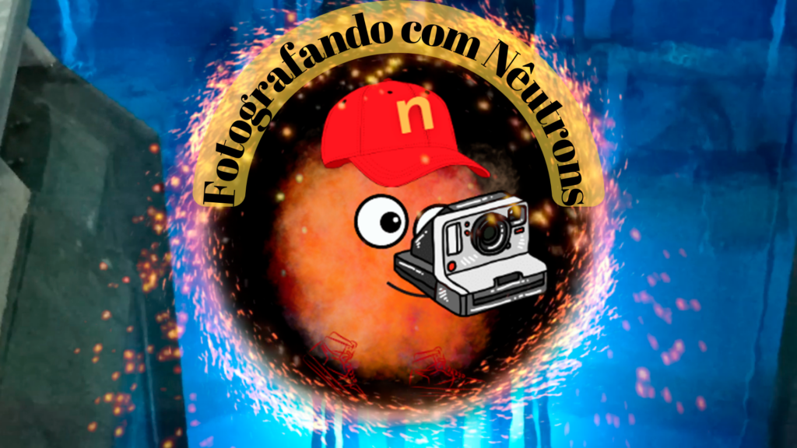

:::: {.texto-justificado}

 

  
  

    Fonte: do autor
  

 

---



---

A Fotografia é uma reprodução fiel de algo.  Tecnicamente, a fotografia produz imagem que registra o que nossos olhos podem ver, enquanto a radiografia pode ser interpretada como a obtenção de uma fotografia que enxerga mais profundamente, isto é, que pode enxergar a estrutura interna de diversos tipos de objetos, como as radiografias de ossos muito utilizadas por ortopedistas para avaliar trincas ou quebras ósseas.

O primeiro experimento envolvendo radiografia foi realizado em 1895 pelo físico alemão Wilhelm Conrad Röntgen, utilizando uma radiação até então desconhecida, a qual chamou de X e, embora fosse um nome provisório, sua descoberta foi um marco científico tão importante nas ciências (principalmente na área médica) que este nome foi naturalmente adotado. O primeiro aparelho de Radiologia do Brasil foi  instalado em Minas Gerais no final do século 19.

Outra radiação que também pode ser utilizada para a geração de imagens é o nêutron. Em 1937 foi realizado o primeiro experimento envolvendo radiografia com nêutrons, também na Alemanha, utilizando nêutrons produzidos em acelerador de partículas. Progressos foram obtidos em 1956, utilizando feixe de nêutrons obtidos em reator nuclear (de maior intensidade) melhorando a qualidade das imagens. Mas melhorias significativas viriam de 1990, com o uso de dispositivos para digitalização de imagens em 3D, possibilitando a elaboração de equipamentos operacionais para Tomografia.

Em 1987 a radiografia com nêutrons passou a ser realizada no Brasil, no Reator Nuclear de Pesquisas IEA-R1 do Instituto de Pesquisas Energéticas e Nucleares (IPEN-CNEN/SP) e, nessas décadas, essa instalação tem sido aprimorada. Hoje são realizados experimentos de Tomografia com Nêutrons, que geram imagens tridimensionais de excelente qualidade.

O Pesquisador Marco Antonio Stanojev Pereira, Doutor em Tecnologia Nuclear e autor do livro Imageamento com nêutrons: 30 anos de atividades no IPEN-CNEN/SP, que atua nesta linha de pesquisa desde 2000, vai falar das pesquisas e aplicações e contar mais sobre a história da neutrografia. Assista o vídeo e veja o que as radiografias com nêutrons podem revelar.

Fontes:

<a href="https://www.sciencedirect.com/science/article/pii/S1875389213000163"> “Brenizer, J. S. A review of significant advances in neutron imaging from conception to the present. Physics Procedia, v. 43, p. 10-20, 2013.” </a>

<a href="https://www.google.com/url?sa=t&rct=j&q=&esrc=s&source=web&cd=&cad=rja&uact=8&ved=2ahUKEwjD7-HN7saBAxWcG7kGHQXMC3IQFnoECBIQAQ&url=https%3A%2F%2Fwww.slac.stanford.edu%2Fpubs%2Fbeamline%2F25%2F2%2F25-2-assmus.pdf&usg=AOvVaw1SqwAdmnJlw5C-B9-GW1kG&opi=89978449"> “FISHER, C. O. The history of the first radiographs in Berlim. In: FOURTH WORLD CONFERENCE ON NEUTRON RADIOGRAPHY. 1992. p. 3-10.” </a>

<a href="https://www.ipen.br/biblioteca/slr/cel/1062"> “Marco Antonio Stanojev Pereira. Imageamento com nêutrons: 30 anos de atividades no IPEN-CNEN/SP. Sagitarius Editora, 1ª Edição – São Paulo – Dezembro, 2017.” </a>

::::
