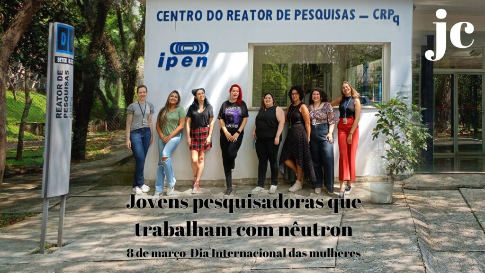

:::: {.texto-justificado}

 

  
  

    Fonte: do autor
  

 

No Centro do Reator de Pesquisas do Instituto de Pesquisas Energéticas e Nucleares (CERPQ/IPEN) jovens pesquisadoras realizam diferentes atividades com nêutrons que são gerados no Reator IEA-R1.

Com nêutrons é possível identificar e quantificar elementos químicos, o que possibilita realização de pesquisa científica nas áreas de Física Nuclear Experimental e da Matéria Condensada, bem como de Análise por Ativação Neutrônica, além da produção e calibração de fontes radioativas.

Na área de nutrição os nêutrons podem ser utilizados, por exemplo, para investigação do teor mineral de suplementos e alimentos fortificados bem como para controle de qualidade de insumos alimentícios. Na área da saúde para uso em análises clínicas e diferentes investigações tecnológicas voltadas ao desenvolvimento de novos radiofármacos, bem como análise e testes de novos materiais.

Com nêutrons é possível também monitorar a poluição marinha e investigar materiais de interesse ambiental, como água, solo e sedimentos, vegetação e rejeitos. Os nêutrons são também de grande utilidade em análise forense, como na investigação de materiais artísticos que auxiliam a identificação de fraudes, datação, restauro e conservação.

Atualmente, com o avanço de IA várias pesquisas com nêutrons são direcionadas a implementar a área de ciência da saúde, que envolvem desde melhorias em exames de imagem e até a otimização de serviços de medicina nuclear.

Essas jovens cientistas realizam investigações científicas que contribuem para o bem-estar da população e do meio ambiente.  

Conheça as jovens pesquisadoras que atuam no Centro de Reator do Pesquisas do IPEN e as contribuições científicas bem como os avanços tecnológicos e as inovações que essas investigações podem introduzir nas diversas áreas da sociedade.

### Jovens Pesquisadoras do Centro do Reator de Pesquisas

Ana Karolina Defente Caetano/Mestrado: Criação de indicadores de gestão para a atuação do profissional biomédico em serviços de medicina nuclear.

Caroline Rodrigues Albuquerque/ Doutorado: Avaliação de razão elementares em conchas de ostras cultivadas em cativeiro e em ambiente natural como indicador de mudanças ambientais.

Eliziária Abreu/ Estagiaria: Determinação de ferro sanguíneo por FRXDE: estudo comparativo utilizando alvos de Rh, Ag e Au.

Josefa Ferreira Benevides/ Estagiaria: Avaliação de desempenho do espectrômetro de FRX com alvo de Rh.

Julia Ponchio Muraro/Iniciação Científica: Determining Experimental Conditions for soybean analysis by neutron Activation analysis

Larissa Augusta Santos Moura/Iniciação Cientifica: Avaliação da concentração de fósforo em sangue total utilizando a técnica FRXDE.

Leila Cecília Ferreira Conserva/Iniciação Científica: Otimização da metodologia de FRXDE para determinação de Potássio em sangue total.

Luciana Silva Albuquerque de Melo/Mestrado: Desenvolvimento de um algoritmo de segmentação de imagens da próstata utilizando a técnica de Machine Learning.

Maria Gabriela Miquelino Benedito/Iniciação Científica: Determinação de ferro sanguíneo por FRX na população feminina acima de 60 anos: alternativa para prática clínica na medicina geriátrica.

Maria Paula De Oliveira Goes/Mestrado: Avanços no diagnóstico laboratorial com ênfase em recém-nascidos: avaliação dos índices de normalidade em sangue total utilizando a técnica de FRXDE.

Marisa Iglezias da Luz/Mestrado: Determinação da capacidade de adsorção de íons metálicos por nanoplásticos e de adsorção de nanoplásticos em culturas celulares com traçadores radioativos”.

Maite Ozório de Andrade/Mestrado: Síntese de Perovskitas de Haletos Metálicos do tipo Cs (Pb,Sn)(Cl, Br, I)3 e caracterização por medidas de parâmetros hiperfinos em função da temperatura.

Patricia Ramos Carvalho/Pós-doutorado: Estudo geológico de sedimentos da confluência dos rios Negro e Solimões na Amazônia.

Renata Mendes Nory/ Doutorado: Produção do radionuclídeo Lu-177 no reator nuclear IEA-R1 para aplicações em medicina nuclear

Tamires de Araujo Mora/Doutorado: Determinação das variações sazonais e das taxas de deposição de 7Be e 210Pb em água de chuva e aerossóis da floresta tropical amazônica.

Tânia de Paula Brambilla Tchobnian/ Pós-doutorado: Determinação da atividade de emissores gama em rejeitos radioativos operacionais da Central Nuclear Almirante Álvaro Alberto.

Tatiane da Silva Nascimento Sales/ Pós-doutorado: Nanopartículas magnéticas para radioterapia: síntese, caracterização, marcação com radioisótopos e aplicação em células de tumor.



::::
