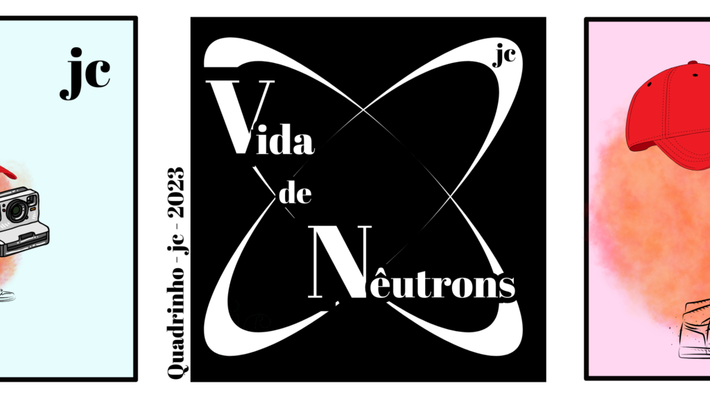
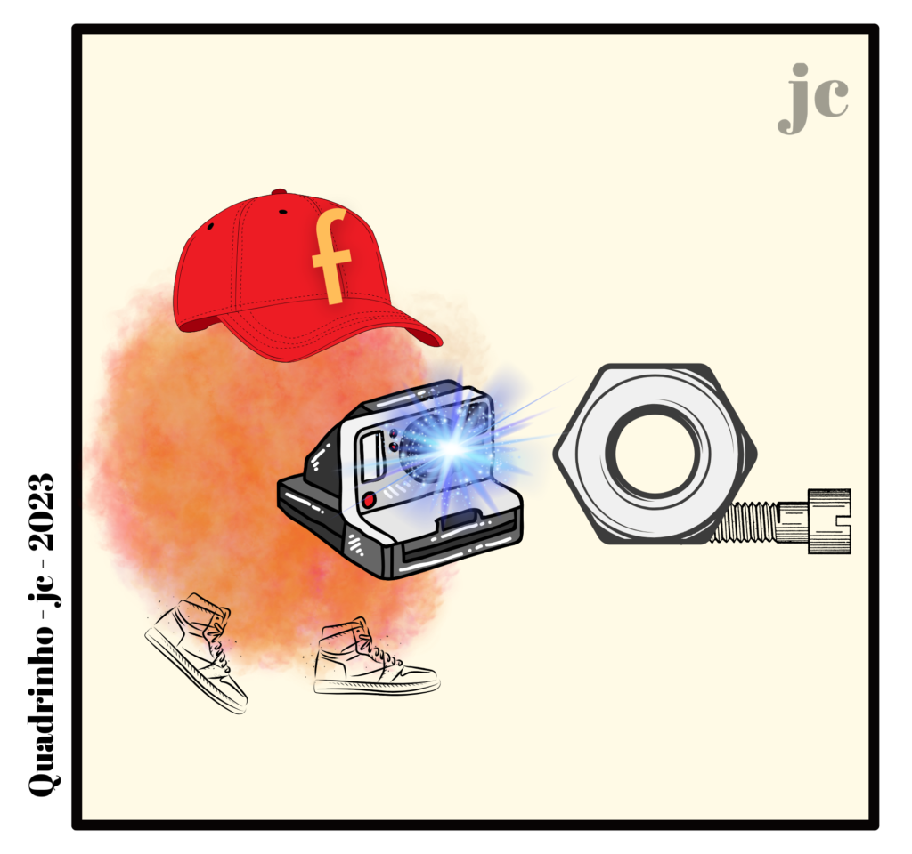

:::: {.texto-justificado}

 

  
  

    Fonte: do autor
  

 

Neutrografia é uma propriedade do nêutron de gerar imagens. É um tipo de radiografia que utiliza nêutrons predominantemente frio.

 

  
  
  
  

    Fonte: do autor
  

 

::::
