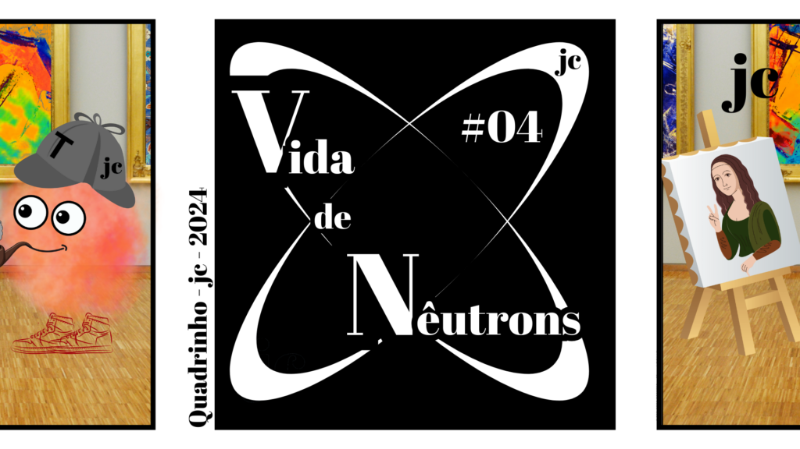

:::: {.texto-justificado}

 

  
  

    Fonte: do autor
  

 

Os nêutrons podem auxiliar na investigação de obras de artes.
Os nêutrons podem dar informação dos elementos químicos presentes em tintas artísticas, pois a presença de certos elementos variam com a sua data de fabricação.

::::
