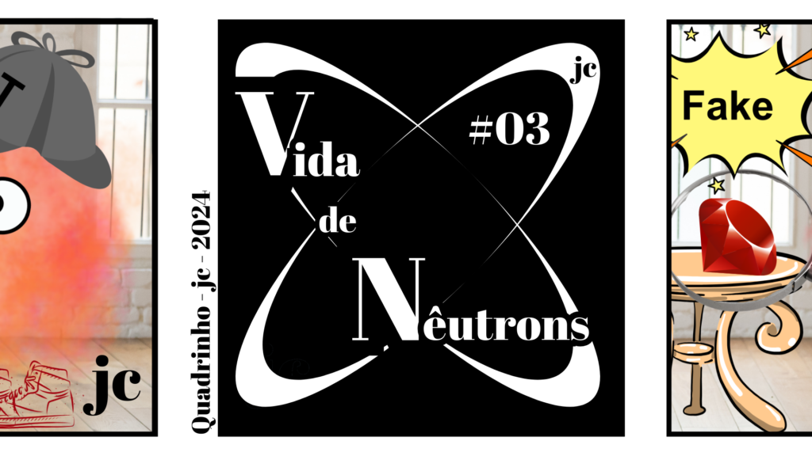
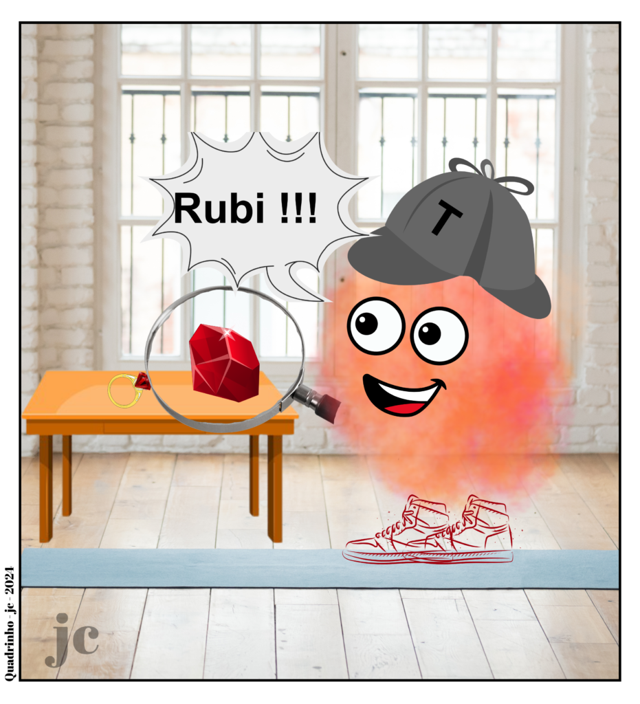
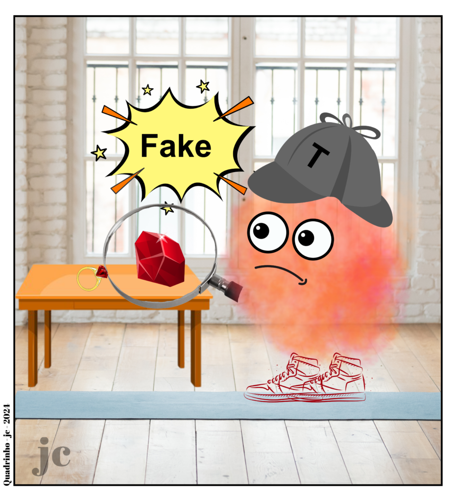

:::: {.texto-justificado}

 

  
  

    Fonte: do autor
  

 

Os nêutrons podem auxiliar na investigação de falsificações de joias.
Os nêutrons podem dar informação dos metais presentes nas joias como mostrar a presença de ouro e prata, bem como identificar elementos que caracterizam pedras preciosas.

 

  
  
  

    Fonte: do autor
  

 

::::
