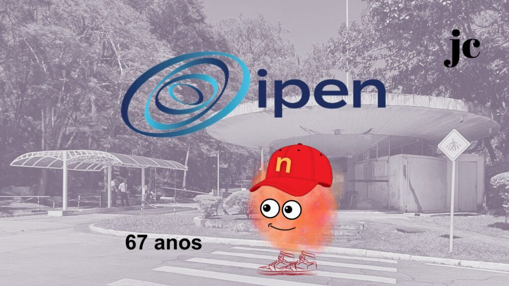

:::: {.texto-justificado}

 

  
  

    Fonte: do autor
  

 

Dia 31 de agosto é o 67º aniversário do IPEN!

E o jovem cientista dá um presente para todos, lançando o quadro vida de Nêutrons.

O Instituto de Pesquisas Energéticas e Nucleares (IPEN) foi fundado em 1956. Está localizado na Cidade Universitária (São Paulo). O IPEN tem pesquisa, inovação tecnológica, formação de recursos humanos, produção de radioisótopos, espaço cultural e muito mais!

Comemore com os pesquisadores e alunos os avanços tecnológicos obtidos no ipen.

Feliz aniversário IPEN!

---



::::
