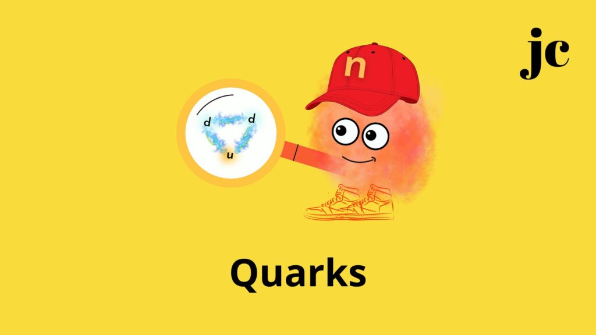

:::: {.texto-justificado}

 

  
  

    Fonte: do autor
  

 

O nêutron mora no núcleo do átomo junto com o próton e são chamados de núcleons.

Os nêutrons possuem carga nula, enquanto os prótons têm carga positiva.

Mas, por que só o próton tem carga?

Porque são formados por outras três partículas, chamadas quarks, que possuem carga.

O nêutron tem dois quarks down e um up.

O próton tem dois quarks up um down.

O quark up tem carga igual a + 2/3.

O quark down tem carga igual a – 1/ 3.

Assim, a carga no nêutron se anula, mas não no próton.

Como os prótons tem carga positiva eles se repelem. Por isso, para se manterem no núcleo são necessários os nêutrons.

O responsável pela união dos quarks são os glúons. Glúons, transmitem a interação nuclear forte entre os quarks, mantendo-os “colados” uns aos outros. Para isso os glúons geram a força mais poderosa que se tem conhecimento no Universo, chegando a ser mais forte do que a gravidade.

Se esta força forte não existe os prótons e nêutrons não conseguiriam se formar e nós, seres humanos, não poderíamos existir.

---



::::
